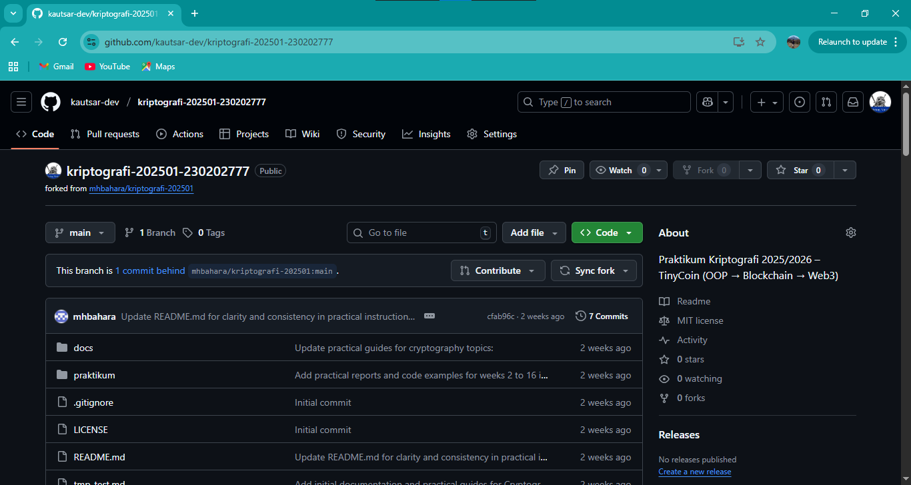
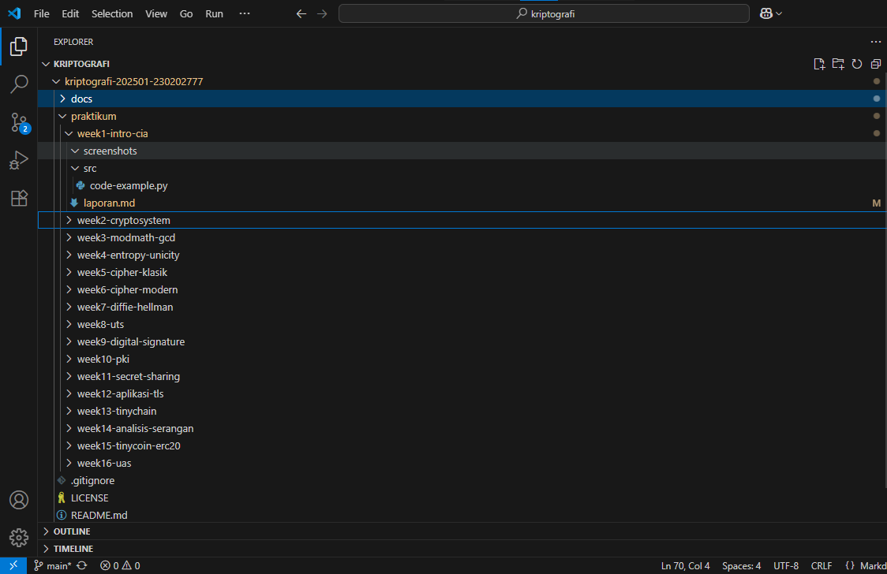
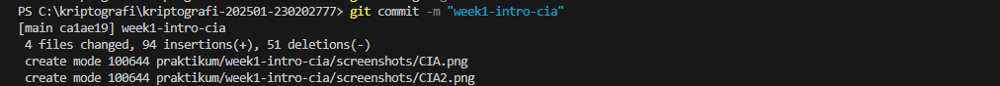

# Laporan Praktikum Kriptografi
Minggu ke-: 1
Topik: [CIA_intro]  
Nama: [Rasya Islami Kautsar]  
NIM: [230202777]  
Kelas: [5IKRB]  

---

## 1. Tujuan
1. Menjelaskan **sejarah dan evolusi kriptografi** dari masa klasik hingga modern.  
2. Menyebutkan **prinsip Confidentiality, Integrity, Availability (CIA)** dengan benar.  
3. Menyimpulkan **peran kriptografi** dalam sistem keamanan informasi modern.  
4. Menyiapkan repositori GitHub sebagai media kerja praktikum.

---

## 2. Dasar Teori
**Sejarah Kriptografi**

Kriptografi adalah ilmu untuk menjaga kerahasiaan dan keamanan informasi. Perkembangannya terbagi menjadi tiga era utama: klasik, modern, dan kontemporer.

Pada masa kriptografi klasik, metode enkripsi masih sederhana, seperti Caesar Cipher yang menggeser huruf dengan jarak tertentu, dan Vigenère Cipher yang menggunakan kata kunci untuk menyulitkan analisis frekuensi. Teknik ini bersifat simetris dan mudah dibobol dengan teknologi modern.

Perkembangan pada kriptografi modern, komputer melahirkan algoritma berbasis matematika yang lebih aman.
Contohnya AES (enkripsi simetris) dan RSA (enkripsi asimetris dengan kunci publik dan privat). Kriptografi modern digunakan luas dalam keamanan data digital seperti pada HTTPS dan email encryption.

Kriptografi Kontemporer, era ini ditandai dengan munculnya blockchain dan cryptocurrency seperti Bitcoin, yang memanfaatkan fungsi hash (misalnya SHA-256) dan tanda tangan digital untuk menjaga integritas serta autentikasi transaksi. Kini juga dikembangkan kriptografi pasca-kuantum untuk menghadapi ancaman dari komputer kuantum.

**Prinsip CIA**

Prinsip CIA(Confidentiality, Integrity, Availability) merupakan fondasi utama dalam keamanan informasi, yang berfungsi untuk melindungi data dari akses tidak sah, perubahan ilegal, dan gangguan layanan.

1. Confidentiality (Kerahasiaan)

Menjamin bahwa informasi hanya dapat diakses oleh pihak yang memiliki izin. Tujuannya adalah mencegah kebocoran data atau penyadapan oleh pihak tidak berwenang.
**Contoh nyata** : Aplikasi pesan terenkripsi seperti WhatsApp dan Signal menggunakan enkripsi end-to-end agar pesan hanya bisa dibaca oleh pengirim dan penerima.

2. Integrity (Keutuhan Data)

Menjaga agar data tetap asli, akurat, dan tidak dimodifikasi tanpa izin. Prinsip ini memastikan bahwa data yang dikirim, disimpan, dan diterima tetap konsisten dengan sumber aslinya.
**Contoh nyata** : Tanda tangan digital pada dokumen elektronik memastikan dokumen tidak diubah setelah ditandatangani.

3. Availability (Ketersediaan)

Menjamin bahwa data dan sistem selalu tersedia dan dapat diakses oleh pengguna yang berhak kapan pun dibutuhkan. Hal ini mencakup perlindungan terhadap gangguan sistem, serangan siber, atau bencana.
**Contoh nyata** : Situs e-commerce besar seperti Tokopedia atau Shopee menggunakan sistem load balancing dan backup data otomatis agar tetap tersedia saat trafik tinggi, seperti saat promo besar.

---

## 3. Alat dan Bahan

- Laptop/PC dengan koneksi internet
- Visual Studio Code
- Akun GitHub(https://github.com)
- Git terinstall dikomputer
- Browser
- Terminal CMD

---

## 4. Langkah Percobaan

1. Membuat akun GitHub (jika belum ada)
2. Melakukan fork repositori template dari dosen
3. Mengganti nama repositori menjadi kripto-20251-230202777
4. Melakukan clone repositori ke komputer lokal
5. Membuat struktur folder praktikum/week1-intro-cia/
6. Mempelajari materi sejarah kriptografi dan prinsip CIA
7. Membuat laporan dalam format Markdown
8. Melakukan commit dan push ke repositori GitHub

---

## 5. Source Code

Belum ada implementasi kode

---

## 6. Hasil dan Pembahasan
**Hasil** :
1. Berhasil membuat repositori GitHub dengan nama kripto-20251-230202777
2. Berhasil melakukan fork dari repositori template dosen
4. Berhasil membuat struktur folder sesuai petunjuk
5. Berhasil membuat laporan praktikum

1. Repositori GitHub
- 
2. Struktur Folder
- 
3. Initial commit
- 

**Pembahasan** :

Praktikum ini memberikan pemahaman dasar tentang sejarah kriptografi dan prinsip CIA dalam keamanan informasi. Melalui praktikum ini, saya belajar tentang:

- Perkembangan kriptografi dari masa ke masa.
- Pentingnya prinsip CIA dalam melindungi informasi.
- Cara menggunakan Git dan GitHub untuk kolaborasi pengembangan perangkat lunak.

---

## 7. Jawaban Quiz
1. Siapa tokoh yang dianggap sebagai bapak kriptografi modern?	
**Jawab** : Tokoh yang secara luas dianggap sebagai bapak kriptografi modern adalah Whitfield Diffie. Karyanya, bersama dengan Martin Hellman, pada tahun 1976 memperkenalkan konsep sistem kunci publik/asimetris yang revolusioner.
2. Sebutkan algoritma kunci publik yang populer digunakan saat ini.	
**Jawab** : Beberapa algoritma kunci publik (asimetris) yang populer digunakan saat ini meliputi: RSA (Rivest-Shamir-Adleman), ECC (Elliptic Curve Cryptography), dan DSA (Digital Signature Algorithm) atau varian modernnya seperti EdDSA (Edwards-curve Digital Signature Algorithm).
3. Apa perbedaan utama antara kriptografi klasik dan kriptografi modern?	
**Jawab** : Perbedaan utama terletak pada kerahasiaan algoritma dan jenis kunci yang digunakan: Kriptografi Klasik (seperti sandi Caesar atau Vigenère) mengandalkan kerahasiaan skema atau alat yang digunakan (keamanan melalui ketidakjelasan) dan umumnya menggunakan kunci simetris yang pendek dan sederhana. Kriptografi Modern (seperti AES atau RSA) mengandalkan prinsip Kerckhoffs' (algoritma diketahui publik, hanya kuncinya yang rahasia) dan menggunakan kunci simetris yang panjang dan kompleks atau pasangan kunci publik/privat (asimetris). Selain itu, kriptografi modern memanfaatkan kemampuan komputasi yang tinggi dan didasarkan pada teori matematika yang kompleks.
---

## 8. Kesimpulan

Berdasarkan praktikum ini, dapat disimpulkan bahwa kriptografi telah berevolusi dari sistem sandi sederhana menjadi sistem keamanan digital berbasis matematika yang kompleks.
Prinsip CIA (Confidentiality, Integrity, Availability) menjadi dasar utama untuk menjaga kerahasiaan, keutuhan, dan ketersediaan data.
Dengan memahami konsep ini, mahasiswa dapat mengerti pentingnya kriptografi dalam melindungi informasi di era digital modern.

---

## 9. Daftar Pustaka

- Katz, J., & Lindell, Y. Introduction to Modern Cryptography.
- Stallings, W. Cryptography and Network Security.
- Diffie, W., & Hellman, M. (1976). New Directions in Cryptography. IEEE Transactions on Information Theory.

---

## 10. Commit Log

```
commit 
Author: Rasya Islami Kautsar <rasyakautsar01@gmail.com>
Date:   2025-10-14

    week1-intro-cia: Sejarah Kriptografi & Prinsip CIA 
```
