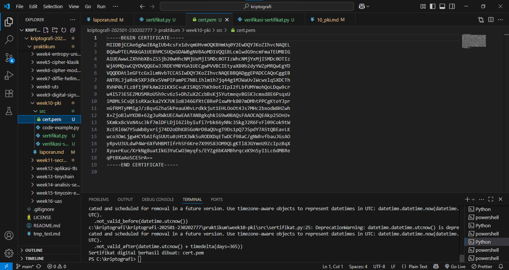
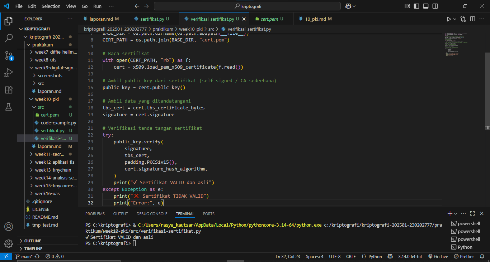

# Laporan Praktikum Kriptografi
Minggu ke-: 10  
Topik: [Public Key Infrastructure]  
Nama: [Rasya Islami Kautsar]  
NIM: [230202777]  
Kelas: [5IKRB]   

---

## 1. Tujuan

1. Membuat sertifikat digital sederhana.  
2. Menjelaskan peran Certificate Authority (CA) dalam sistem PKI.  
3. Mengevaluasi fungsi PKI dalam komunikasi aman (contoh: HTTPS, TLS).

---

## 2. Dasar Teori

Public Key Infrastructure (PKI) merupakan kerangka kerja yang digunakan untuk mengelola penggunaan kriptografi kunci publik dalam sistem digital. PKI menyediakan mekanisme yang memungkinkan pengguna untuk melakukan komunikasi terenkripsi dan verifikasi identitas secara aman. Melalui PKI, keabsahan suatu kunci publik dapat dipastikan sehingga risiko pemalsuan identitas dalam pertukaran data dapat diminimalkan.

Dalam sistem PKI, peran utama dijalankan oleh Certificate Authority (CA) sebagai lembaga terpercaya yang mengeluarkan sertifikat digital. Sertifikat ini menghubungkan identitas suatu entitas dengan kunci publiknya melalui proses validasi tertentu. Tanda tangan digital yang diberikan oleh CA pada sertifikat tersebut menjadi bukti bahwa informasi di dalamnya telah diverifikasi dan dapat dipercaya oleh pihak lain.

PKI juga didukung oleh komponen tambahan seperti Registration Authority (RA) yang berfungsi melakukan pemeriksaan identitas sebelum sertifikat diterbitkan, serta sistem manajemen sertifikat yang menangani masa berlaku dan pencabutan sertifikat. Dengan adanya mekanisme tersebut, PKI berperan penting dalam menjaga keamanan layanan digital, termasuk akses website aman, pertukaran email terlindungi, dan transaksi elektronik yang membutuhkan tingkat kepercayaan tinggi.

---

## 3. Alat dan Bahan

- Python 3.x
- Visual Studio Code
- Git dan akun GitHub
- Google chrome
- Library tambahan (misalnya pycryptodome, jika diperlukan)

---

## 4. Langkah Percobaan

1. Membuat file sertifikat.py di folder praktikum/week10-pki/src/.
2. Menyalin kode program dari panduan praktikum.
3. Menjalankan program dengan perintah python sertifikat.py.
4. Membuat file verifiksi-sertifikat.py di folder praktikum/week10-pki/src/.
5. Modifikasi kode program dari referensi.
6. Membuat folder screenshots di folder praktikum/week10-pki/src/ lalu mengupload hasil praktikum di dalam folder tersebut.
7. Menyelesaikan laporan.md

---

## 5. Source Code

### Langkah 1 — Membuat Sertifikat Digital Sederhana

```python
from cryptography import x509
from cryptography.x509.oid import NameOID
from cryptography.hazmat.primitives import hashes, serialization
from cryptography.hazmat.primitives.asymmetric import rsa
from datetime import datetime, timedelta

# Generate key pair
key = rsa.generate_private_key(public_exponent=65537, key_size=2048)

# Buat subject & issuer (CA sederhana = self-signed)
subject = issuer = x509.Name([
    x509.NameAttribute(NameOID.COUNTRY_NAME, u"ID"),
    x509.NameAttribute(NameOID.ORGANIZATION_NAME, u"UPB Kriptografi"),
    x509.NameAttribute(NameOID.COMMON_NAME, u"example.com"),
])

# Buat sertifikat
cert = (
    x509.CertificateBuilder()
    .subject_name(subject)
    .issuer_name(issuer)
    .public_key(key.public_key())
    .serial_number(x509.random_serial_number())
    .not_valid_before(datetime.utcnow())
    .not_valid_after(datetime.utcnow() + timedelta(days=365))
    .sign(key, hashes.SHA256())
)

# Simpan sertifikat
with open("cert.pem", "wb") as f:
    f.write(cert.public_bytes(serialization.Encoding.PEM))

print("Sertifikat digital berhasil dibuat: cert.pem")
```

**Hasil uji coba (Output program)**
```
Sertifikat digital berhasil dibuat: cert.pem

-----BEGIN CERTIFICATE-----
MIIDBjCCAe6gAwIBAgIUb4csFx1dvqmUHvmOQKBHmUq0Y2EwDQYJKoZIhvcNAQEL
BQAwPTELMAkGA1UEBhMCSUQxGDAWBgNVBAoMD1VQQiBLcmlwdG9ncmFmaTEUMBIG
A1UEAwwLZXhhbXBsZS5jb20wHhcNMjUxMjI5MDc0OTIzWhcNMjYxMjI5MDc0OTIz
WjA9MQswCQYDVQQGEwJJRDEYMBYGA1UECgwPVVBCIEtyaXB0b2dyYWZpMRQwEgYD
VQQDDAtleGFtcGxlLmNvbTCCASIwDQYJKoZIhvcNAQEBBQADggEPADCCAQoCggEB
ANTRLJjaRnk5XPJdkvSVmPIPamPE7N8Lihlm1h7jq44g1MJWaUvlWcwxlqSXDCTh
RVHP0LFLz8f1jMFkAm22iKX5C+uKISRQ57hKh9otJIpI2fLbfUMYmohQoLDqw9cr
w4IS73E5EZMUSMRoU5h9cv6z5+DhZuX2CzbBsKjSYutmeqvBG5K3cmxd8E6PsqxU
iM8ML5CsQE1sRXacka2YX7UKioBJ46GfRtCBRePixwMrk807mDMhtPPCgKteYJpr
nGfRMTyMMigJ/zBqvGZha5kPeauU0vLrdkkjut1EHLOoOt4Js7MHc2bxodW8HZwh
X+ZjoBlwYKDB+62gJuRWkUECAwEAATANBgkqhkiG9w0BAQsFAAOCAQEAkp2SOnU+
SKmkx8cVxN4sc3kf7mlDFLDji6ZibyIufi7rbk66yNNc3SkgJ2R6FvFl09Cok9tW
XcERl6W7YSuWb8yxrij74D2oDhK85GoNrD8aQUvgT9Ds1pQ7JSpdY7A5tQBEavLK
wco3OmLjgwHCYbAIfq5UUtu0zHtX3Wk5uRODXDqETwDCf98aC/gNWhvfbauJGsAO
yRpvU3ULdwP4Wr6XfVHBMTifrh5F6Kre7X99S83OM9QLgKTl8JGYmnU9ZcIpzBqX
Xyu+rKuc/KrkNg8uatIkG3YuCwO3myqfs/EYZg6bKAMBhrqcxK9nSyI1Lc6dMBRe
qPtBXaAoSCE5rA==
-----END CERTIFICATE-----
```

### Langkah 2 — Memverifikasi Sertifikat

Jelaskan bagaimana CA digunakan untuk menjamin keaslian sertifikat.

Jawab: Certificate Authority (CA) menjamin keaslian sertifikat dengan memverifikasi identitas pemilik, lalu menandatangani sertifikat menggunakan kunci privat CA. Browser memeriksa tanda tangan tersebut menggunakan kunci publik CA yang sudah tepercaya. Jika valid, masih berlaku, dan tidak dicabut, maka sertifikat dianggap asli dan aman, sehingga mencegah pemalsuan dan serangan MITM.

### Langkah 3 — Analisis PKI

- Bagaimana browser memverifikasi sertifikat HTTPS?

Dengan memeriksa rantai sertifikat hingga root Certificate Authority (CA) yang dipercaya, memvalidasi tanda tangan digital menggunakan public key CA untuk memastikan sertifikat tidak dimodifikasi, mengecek masa berlaku sertifikat, mencocokkan nama domain, serta memastikan sertifikat tidak dicabut melalui CRL atau OCSP. Jika seluruh proses ini berhasil, browser melanjutkan negosiasi TLS dan menampilkan ikon gembok sebagai tanda koneksi aman.

- Apa yang terjadi jika CA palsu menerbitkan sertifikat?

Jika CA palsu menerbitkan sertifikat, browser akan menolaknya karena CA tersebut tidak ada dalam trust store browser atau sistem operasi, sehingga sertifikat dianggap tidak terpercaya dan koneksi HTTPS akan diblokir atau menampilkan peringatan keamanan.

- Mengapa PKI penting dalam komunikasi aman (misalnya transaksi online)?

PKI penting dalam komunikasi aman karena menyediakan mekanisme kepercayaan melalui sertifikat digital yang mengaitkan identitas pihak dengan kunci publiknya, memungkinkan enkripsi data, otentikasi server, dan verifikasi integritas informasi, sehingga mencegah penyadapan, pemalsuan identitas, dan serangan man-in-the-middle dalam transaksi online.

---

## 6. Hasil dan Pembahasan

- **Hasil eksekusi Langkah 1 — Membuat Sertifikat Digital Sederhana**


- **Hasil eksekusi Langkah 2 — Memverifikasi Sertifikat**


---

## 7. Jawaban Pertanyaan

1. Apa fungsi utama Certificate Authority (CA)?  

Memverifikasi identitas pihak yang terlibat dalam komunikasi digital dan menerbitkan sertifikat digital. Sertifikat ini mengaitkan identitas pemilik (orang, organisasi, atau server) dengan kunci publik miliknya, sehingga pihak lain dapat mempercayai bahwa kunci publik tersebut benar-benar valid. Dengan peran ini, CA membantu menjamin keaslian (authentication), kepercayaan, dan mendukung keamanan seperti enkripsi serta tanda tangan digital dalam sistem PKI.

2. Mengapa self-signed certificate tidak cukup untuk sistem produksi? 

Karena tidak ada pihak tepercaya yang memverifikasi identitas pemilik sertifikat. Sertifikat ini ditandatangani oleh dirinya sendiri, sehingga klien atau browser tidak dapat memastikan keasliannya dan biasanya akan menampilkan peringatan keamanan. Akibatnya, self-signed certificate rentan terhadap serangan man-in-the-middle, tidak membangun kepercayaan pengguna, dan tidak memenuhi standar keamanan maupun kepatuhan yang dibutuhkan pada lingkungan produksi.

3. Bagaimana PKI mencegah serangan MITM dalam komunikasi TLS/HTTPS?

PKI mencegah serangan Man-in-the-Middle (MITM) pada komunikasi TLS/HTTPS dengan memastikan keaslian identitas server melalui sertifikat digital. Saat klien terhubung, server mengirimkan sertifikat yang ditandatangani oleh Certificate Authority (CA) tepercaya. Klien memverifikasi tanda tangan CA, masa berlaku, dan kesesuaian nama domain. Jika valid, klien yakin bahwa kunci publik tersebut benar-benar milik server yang sah. Selanjutnya, proses handshake TLS menggunakan kunci publik ini untuk membentuk kunci sesi terenkripsi, sehingga penyerang tidak dapat menyamar sebagai server atau membaca maupun mengubah data yang dikirim.

---

## 8. Kesimpulan

Berdasarkan praktikum yang telah dilakukan, dapat disimpulkan bahwa Public Key Infrastructure (PKI) merupakan komponen penting dalam sistem keamanan komunikasi digital. Melalui pembuatan dan verifikasi sertifikat digital, PKI mampu memastikan keaslian identitas, integritas data, dan keamanan pertukaran informasi menggunakan kriptografi kunci publik. Peran Certificate Authority (CA) sangat krusial sebagai pihak tepercaya yang memvalidasi identitas dan menerbitkan sertifikat digital. Hasil praktikum menunjukkan bahwa sertifikat digital dapat diverifikasi keasliannya melalui pemeriksaan tanda tangan digital, sehingga mendukung keamanan komunikasi seperti pada HTTPS dan TLS serta mencegah serangan seperti man-in-the-middle.

---

## 9. Daftar Pustaka

- Stallings, W. (2017). Cryptography and Network Security: Principles and Practice. Pearson Education.
- Kahn Academy. Public Key Infrastructure (PKI).
- Mozilla Developer Network (MDN). HTTPS and TLS Overview.
- Panduan Praktikum Kriptografi Minggu ke-10: Public Key Infrastructure (PKI & Certificate Authority).

---

## 10. Commit Log

```
commit week10-pki
Author: Rasya Islami Kautsar <rasyakautsar01@gmail.com>
Date:   2025-12-29

    week10-pki: Public Key Infrastructure (PKI & Certificate Authority)                    
```
