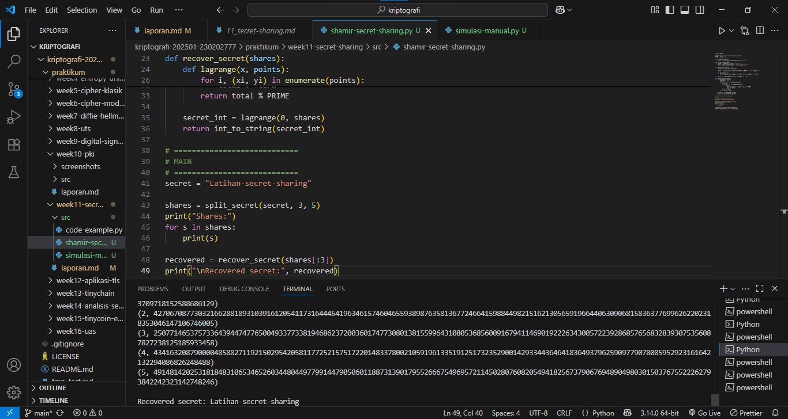
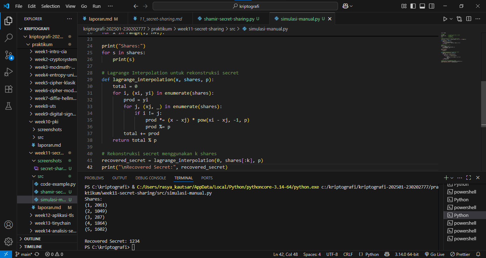

# Laporan Praktikum Kriptografi
Minggu ke-: 11  
Topik: [Secret Sharing]  
Nama: [Rasya Islami Kautsar]  
NIM: [230202777]  
Kelas: [5IKRB]  

---

## 1. Tujuan

1. Menjelaskan konsep **Shamir Secret Sharing** (SSS).  
2. Melakukan simulasi pembagian rahasia ke beberapa pihak menggunakan skema SSS.  
3. Menganalisis keamanan skema distribusi rahasia.

---

## 2. Dasar Teori

Shamir Secret Sharing adalah metode kriptografi untuk membagi sebuah rahasia menjadi beberapa bagian (share) yang didistribusikan ke banyak pihak. Teknik ini diperkenalkan oleh Adi Shamir pada tahun 1979 dengan tujuan meningkatkan keamanan, sehingga tidak ada satu pihak pun yang dapat mengetahui rahasia secara utuh.

Skema ini menggunakan konsep threshold (k, n), di mana rahasia dibagi menjadi n bagian dan hanya dapat direkonstruksi jika minimal k bagian digabungkan. Prinsip kerjanya berbasis polinomial, sehingga rahasia tetap aman selama jumlah share yang terkumpul kurang dari k.

Metode ini banyak digunakan dalam manajemen kunci kriptografi, pencadangan data penting, dan sistem keamanan terdistribusi karena mampu meningkatkan keamanan sekaligus menjaga ketersediaan informasi.

---

## 3. Alat dan Bahan

- Python 3.x
- Visual Studio Code
- Git dan akun GitHub
- Google chrome
- Library tambahan (misalnya pycryptodome, jika diperlukan)

---

## 4. Langkah Percobaan

1. Membuat file secret-sharing.py di folder praktikum/week11-secret-sharing/src/.
2. Menyalin kode program dari panduan praktikum.
3. Menjalankan program dengan perintah python secret-sharing.py.
4. Membuat file simulasi-manual.py di folder praktikum/week11-secret-sharing/src/.
5. Modifikasi kode program dari referensi.
6. Membuat folder screenshots di folder praktikum/week11-secret-sharing/src/ lalu mengupload hasil praktikum di dalam folder tersebut.

---

## 5. Source Code

### Langkah 1 — Implementasi Shamir Secret Sharing
```python
import random

# PRIME besar (harus lebih besar dari secret)
PRIME = 2**521 - 1

def string_to_int(text):
    return int.from_bytes(text.encode("utf-8"), "big")

def int_to_string(number):
    length = (number.bit_length() + 7) // 8
    return number.to_bytes(length, "big").decode("utf-8")

def split_secret(secret, k, n):
    secret_int = string_to_int(secret)

    coeffs = [secret_int] + [random.randrange(1, PRIME) for _ in range(k - 1)]

    def polynomial(x):
        return sum(coeffs[i] * pow(x, i, PRIME) for i in range(k)) % PRIME

    return [(i, polynomial(i)) for i in range(1, n + 1)]

def recover_secret(shares):
    def lagrange(x, points):
        total = 0
        for i, (xi, yi) in enumerate(points):
            term = yi
            for j, (xj, _) in enumerate(points):
                if i != j:
                    term *= (x - xj) * pow(xi - xj, -1, PRIME)
                    term %= PRIME
            total += term
        return total % PRIME

    secret_int = lagrange(0, shares)
    return int_to_string(secret_int)

# ============================
# MAIN
# ============================
secret = "Latihan-secret-sharing"

shares = split_secret(secret, 3, 5)
print("Shares:")
for s in shares:
    print(s)

recovered = recover_secret(shares[:3])
print("\nRecovered secret:", recovered)
```

**Hasil uji coba (Output program)**
```
Shares:
(1, 5723031879427641053997072088838557239548300013004102621432850742355411428130925453000432113730750251482913625431374508524464431762483700333709718152588686129)
(2, 4270670877303216628818931039161205411731644454196346157460465593898763581367724664159884498215162130565919664406309068158363776996262202318353046147106746005)
(3, 2507714653757336439447477650049337733819468623720036017477308013815599643108053685600916794114690192226343005722392868576568328393075356087827238125185933458)
(4, 434163208790000485882711921502954205811772521575172201483378002105919613351912517323529001429334436464183649379625909779078085952923161642132294086826248488)
(5, 4914814202531818483106534652603448044977991447905060118873139017955266675496957211450280760820549418256737906769489049803015037675522262793842242323142748246)

Recovered secret: Latihan-secret-sharing
```

### Langkah 2 — Simulasi Manual (Tanpa Library)
```python
import random

# Parameter
p = 2089            # bilangan prima (harus > secret)
secret = 1234       # rahasia (a0)
k = 3               # threshold
n = 5               # jumlah share

# Bangun polinomial f(x) = a0 + a1*x + a2*x^2 mod p
coefficients = [secret] + [random.randint(1, p-1) for _ in range(k-1)]

def polynomial(x, coeffs, p):
    result = 0
    for i in range(len(coeffs)):
        result = (result + coeffs[i] * pow(x, i)) % p
    return result

# Membuat shares (x, f(x))
shares = []
for x in range(1, n+1):
    y = polynomial(x, coefficients, p)
    shares.append((x, y))

print("Shares:")
for s in shares:
    print(s)

# Lagrange Interpolation untuk rekonstruksi secret
def lagrange_interpolation(x, shares, p):
    total = 0
    for i, (xi, yi) in enumerate(shares):
        prod = yi
        for j, (xj, _) in enumerate(shares):
            if i != j:
                prod *= (x - xj) * pow(xi - xj, -1, p)
                prod %= p
        total += prod
    return total % p

# Rekonstruksi secret menggunakan k shares
recovered_secret = lagrange_interpolation(0, shares[:k], p)
print("\nRecovered Secret:", recovered_secret) 
```

**Hasil uji coba (Output program)**
```
Shares:
(1, 2061)
(2, 1049)
(3, 287)
(4, 1864)
(5, 1602)

Recovered Secret: 1234
```

### Langkah 3 — Analisis Keamanan

- Mengapa skema (k, n) aman meskipun sebagian share bocor?
Skema (k, n) tetap aman meskipun sebagian share bocor karena rahasia disimpan dalam polinomial berderajat (k−1). Secara matematis, diperlukan minimal k share untuk membentuk satu polinomial yang unik. Jika share yang tersedia kurang dari k, maka rahasia tidak bisa ditentukan. Oleh karena itu, kebocoran sebagian share tidak membahayakan selama jumlahnya masih di bawah threshold k.
- Apa risiko jika threshold k terlalu kecil atau terlalu besar?
Jika k terlalu kecil, rahasia menjadi mudah direkonstruksi dan risiko penyalahgunaan meningkat. Sebaliknya, jika k terlalu besar, risiko kehilangan share meningkat sehingga rahasia bisa gagal dipulihkan. Karena itu, nilai k harus dipilih secara seimbang agar keamanan dan ketersediaan sama-sama terjaga.
- Bagaimana penerapan SSS di dunia nyata (contoh: manajemen kunci cryptocurrency, recovery password)? 
Shamir’s Secret Sharing digunakan dalam pengelolaan kunci cryptocurrency, pemulihan data, dan backup sistem penting. Rahasia dibagi ke beberapa pihak dan hanya dapat dipulihkan jika jumlah share mencukupi, sehingga keamanan meningkat dan risiko kegagalan akibat satu titik lemah dapat dihindari.

---

## 6. Hasil dan Pembahasan

- **Hasil eksekusi Langkah 1 — Implementasi Shamir Secret Sharing**

- **Hasil eksekusi Langkah 2 — Simulasi Manual (Tanpa Library)**


- **Pembahasan**
Pada Langkah 1, Shamir’s Secret Sharing diterapkan dengan menggunakan bilangan prima berukuran besar untuk membagi rahasia berupa string “Latihan-secret-sharing” ke dalam lima buah share dengan nilai ambang tiga. Setiap share diperoleh dari hasil evaluasi polinomial dan tidak memberikan informasi apa pun tentang rahasia jika berdiri sendiri. Ketika tiga share digabungkan dalam proses rekonstruksi, rahasia asli dapat diperoleh kembali, yang membuktikan bahwa algoritma berjalan sesuai prinsipnya.

Pada Langkah 2, dilakukan perhitungan simulasi menggunakan bilangan prima kecil dan rahasia dalam bentuk numerik. Polinomial dibangun dengan cara yang lebih sederhana, kemudian nilai share dihitung secara manual. Melalui proses interpolasi Lagrange dengan tiga share, nilai rahasia berhasil dikembalikan. Hasil ini menunjukkan bahwa baik penerapan pada kondisi nyata maupun simulasi sederhana tetap menggunakan konsep yang sama, yaitu rahasia hanya dapat direkonstruksi apabila jumlah share yang digunakan memenuhi nilai ambang batas yang ditentukan.

---

## 7. Jawaban Pertanyaan

1. Apa keuntungan utama Shamir Secret Sharing dibanding membagikan salinan kunci secara langsung?  
Keuntungan utama Shamir’s Secret Sharing adalah keamanan yang lebih tinggi. Rahasia tidak dibagikan sebagai salinan utuh, melainkan dipecah menjadi beberapa bagian yang tidak berarti sendiri. Rahasia hanya bisa dibuka jika jumlah share mencapai ambang batas, sehingga kebocoran satu share tidak langsung membahayakan sistem dan risiko single point of failure dapat dihindari.

2. Apa peran **threshold (k)** dalam keamanan secret sharing?  
Threshold (k) berperan sebagai batas minimum jumlah share yang harus dikumpulkan untuk merekonstruksi rahasia. Nilai ini menentukan tingkat keamanan dan kontrol akses, selama jumlah share yang tersedia kurang dari k, rahasia tidak dapat diketahui. Dengan demikian, threshold memastikan bahwa rahasia hanya bisa dibuka melalui kerja sama sejumlah pihak yang telah ditentukan.

3. Berikan satu contoh skenario nyata di mana SSS sangat bermanfaat.
Salah satu contoh nyata penggunaan Shamir’s Secret Sharing (SSS) adalah pada pengelolaan private key cryptocurrency perusahaan. Private key dibagi ke beberapa pihak, misalnya direktur, manajer keuangan, dan auditor. Transaksi atau pemulihan aset hanya dapat dilakukan jika jumlah share yang memenuhi threshold dikumpulkan, sehingga mencegah penyalahgunaan oleh satu orang dan mengurangi risiko kehilangan kunci secara total.

---

## 8. Kesimpulan

Berdasarkan hasil praktikum, Shamir’s Secret Sharing terbukti mampu membagi rahasia ke beberapa pihak secara aman menggunakan skema threshold (k, n). Rahasia tidak dapat direkonstruksi jika jumlah share yang tersedia kurang dari nilai ambang batas, sehingga keamanan tetap terjaga meskipun sebagian share bocor. Selain itu, baik implementasi menggunakan bilangan prima besar maupun simulasi manual menunjukkan prinsip kerja yang konsisten dan efektif dalam menjaga kerahasiaan data.

---

## 9. Daftar Pustaka

- Shamir, A. (1979). How to Share a Secret. Communications of the ACM, 22(11), 612–613.
- Katz, J., & Lindell, Y. (2014). Introduction to Modern Cryptography. CRC Press.
- Menezes, A. J., van Oorschot, P. C., & Vanstone, S. A. (1996). Handbook of Applied Cryptography. CRC Press.
- Panduan Praktikum Kriptografi Minggu ke-11: Secret Sharing (Shamir’s Secret Sharing).

---

## 10. Commit Log

```
commit week11-secret-sharing
Author: Rasya Islami Kautsar <rasyakautsar01@gmail.com>
Date:   2026-01-20

    week11-secret-sharing: Secret Sharing (Shamir’s Secret Sharing)                    
```
