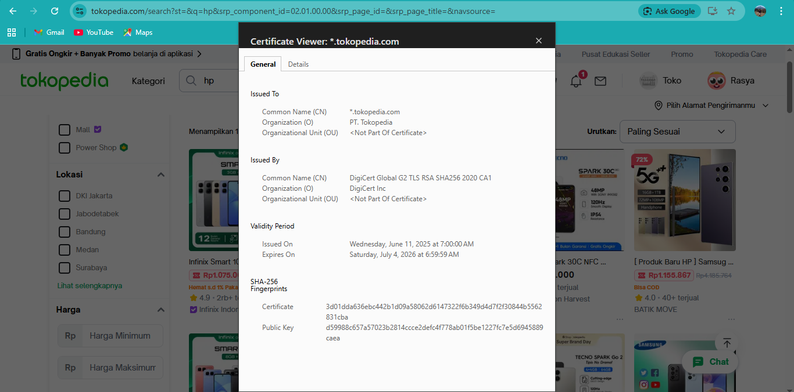

# Laporan Praktikum Kriptografi
Minggu ke-: 12  
Topik: [Aplikasi TLS & E-commerce]  
Nama: [Rasya Islami Kautsar]  
NIM: [230202777]  
Kelas: [5IKRB]  

---

## 1. Tujuan

1. Menganalisis penggunaan kriptografi pada **email** dan **SSL/TLS**.  
2. Menjelaskan enkripsi dalam transaksi **e-commerce**.  
3. Mengevaluasi isu **etika & privasi** dalam penggunaan kriptografi di kehidupan sehari-hari.

---

## 2. Dasar Teori

Transport Layer Security (TLS) adalah protokol yang digunakan untuk mengamankan komunikasi antara browser pengguna dan server. Pada e-commerce, TLS berfungsi mengenkripsi data penting seperti username, password, dan informasi pembayaran agar tidak dapat dibaca oleh pihak lain selama proses pengiriman data.

Selain enkripsi, TLS juga memastikan keaslian server melalui sertifikat digital. Hal ini membantu pengguna yakin bahwa mereka berinteraksi dengan situs e-commerce yang resmi, sehingga dapat mencegah serangan seperti Man-in-the-Middle (MITM) dan pemalsuan website.

Dengan penerapan TLS (HTTPS), transaksi e-commerce menjadi lebih aman dan terpercaya. TLS menjaga kerahasiaan dan keutuhan data, serta meningkatkan kepercayaan pelanggan terhadap layanan e-commerce yang digunakan.

---

## 3. Alat dan Bahan

- Python 3.x
- Visual Studio Code
- Git dan akun GitHub
- Google chrome
- Library tambahan (misalnya pycryptodome, jika diperlukan)

---

## 4. Langkah Percobaan

### Langkah 1 — Analisis SSL/TLS pada Email & Web (Tokopedia)
Berdasarkan hasil pengecekan sertifikat digital pada website tokopedia.com menggunakan browser Google Chrome, dapat diketahui bahwa Tokopedia telah menggunakan protokol HTTPS yang menandakan koneksi aman dan terenkripsi. Sertifikat digital tersebut mencakup seluruh subdomain Tokopedia.

- Issuer CA (Certificate Authority): DigiCert Global G2 TLS RSA SHA256 2020 CA1 dan Organisasi: DigiCert Inc
Ini menunjukkan bahwa sertifikat Tokopedia diterbitkan oleh CA tepercaya secara global.

- Masa Berlaku Sertifikat: Issued On: 11 Juni 2025 dan Expires On: 4 Juli 2026, Masa berlaku ±1 tahun, sesuai standar keamanan sertifikat modern.

- Algoritma Enkripsi yang Digunakan: Asymmetric Encryption: RSA dan Hash / Signature: SHA-256, (Dalam sesi TLS): RSA digunakan untuk pertukaran kunci, sedangkan enkripsi data menggunakan algoritma simetris yang aman (umumnya AES).

Perbandingan HTTPS dan HTTP:

- Website dengan HTTPS: Data terenkripsi menggunakan TLS sehingga aman dari penyadapan, Identitas server diverifikasi melalui sertifikat digital, Melindungi pengguna dari serangan Man-in-the-Middle (MITM).
- Website tanpa HTTPS: Data dikirim dalam bentuk teks biasa (plaintext), Mudah disadap dan dimodifikasi oleh pihak ketiga, Sangat berisiko untuk login, transaksi, dan pengiriman data sensitif.

### Langkah 2 — Studi Kasus E-commerce (Tokopedia)

Tokopedia menggunakan protokol TLS (Transport Layer Security) penerus dari SSL untuk mengamankan jalur komunikasi antara perangkat pengguna (browser/aplikasi) dan server mereka.

1. Saat Login (Proteksi Kredensial)
Ketika Anda memasukkan username dan password, enkripsi bekerja dengan cara:

- Enkripsi End-to-End: Data diacak menjadi kode rahasia sebelum dikirim melalui internet. Bahkan jika data tersebut dicegat di tengah jalan, peretas hanya akan melihat deretan karakter acak yang tidak masuk akal.
- Hashing Password: Di sisi server, Tokopedia tidak menyimpan password dalam bentuk teks biasa. Mereka menggunakan fungsi hash (seperti SHA-256 atau bcrypt). Jadi, meskipun database mereka bocor, password asli pengguna tetap terlindungi karena fungsi hash bersifat satu arah (tidak bisa dikembalikan ke teks asli).

2. Saat Pembayaran (Proteksi Data Finansial)
Pada fase pembayaran, standar keamanan yang digunakan lebih ketat (seringkali mematuhi standar PCI DSS):

- Tokenisasi: Untuk informasi kartu kredit atau dompet digital (seperti GoPay), nomor asli seringkali diganti dengan "token" unik. Enkripsi memastikan bahwa detail kartu tidak pernah terpapar secara penuh selama proses transmisi.
- Integritas Data: TLS memastikan bahwa nominal pembayaran tidak dimodifikasi oleh pihak ketiga saat data sedang dikirim.

Jika TLS tidak digunakan, komunikasi antara pengguna dan server menjadi sangat rentan terhadap berbagai ancaman keamanan. Salah satu ancaman utama adalah serangan Man-in-the-Middle (MITM), di mana penyerang dapat menyadap, mencuri, atau mengubah data yang dikirim, seperti mencuri kredensial login atau memanipulasi informasi pembayaran. Selain itu, tanpa TLS, pengguna juga berisiko terhubung ke website palsu yang meniru tampilan Tokopedia (phishing). Oleh karena itu, penggunaan TLS menjadi elemen penting dalam menjaga keamanan transaksi online, melindungi data pengguna, dan mempertahankan kepercayaan terhadap layanan e-commerce.

### Langkah 3 — Analisis Etika & Privasi

1. Isu Privasi Email Terenkripsi (PGP, S/MIME)
- Email terenkripsi melindungi isi pesan dari pihak luar.
- PGP bersifat end-to-end (hanya pengirim & penerima yang bisa membaca).
- S/MIME sering dikelola perusahaan, sehingga perusahaan berpotensi bisa mengakses email.

2. Apakah perusahaan boleh mendekripsi email karyawan?

Boleh jika email adalah email kerja, ada kebijakan tertulis dan transparan, hanya untuk audit, keamanan, atau investigasi tertentu. Tidak etis jika dilakukan diam-diam, bersifat massal atau berlebihan.

3. Pengawasan pemerintah terhadap komunikasi terenkripsi

Pemerintah dapat mengawasi untuk keamanan dan penegakan hukum. Pengawasan tidak boleh massal dan harus berdasarkan hukum dengan izin resmi. Enkripsi tetap penting untuk melindungi privasi masyarakat.

---

## 5. Source Code's

---

## 6. Hasil dan Pembahasan

- **Hasil eksekusi Sertifikat Tokopedia**


- **Pembahasan**

Berdasarkan praktikum yang dilakukan, Tokopedia telah menerapkan protokol SSL/TLS (HTTPS) dengan baik untuk mengamankan komunikasi antara pengguna dan server. Penggunaan sertifikat digital dari CA tepercaya (DigiCert) memastikan keaslian server serta memungkinkan enkripsi data selama proses transmisi, sehingga data sensitif pengguna terlindungi dari penyadapan.

Penerapan TLS sangat penting pada proses login dan pembayaran, karena data kredensial dan informasi finansial dienkripsi serta dijaga integritasnya agar tidak dimodifikasi oleh pihak ketiga. Selain itu, perbedaan antara HTTPS dan HTTP menunjukkan bahwa HTTPS jauh lebih aman dan mampu mencegah serangan seperti Man-in-the-Middle (MITM). Dari sisi etika dan privasi, kriptografi melindungi komunikasi digital, namun tetap memerlukan kebijakan dan regulasi yang jelas agar keamanan tidak melanggar hak privasi pengguna.

---

## 7. Jawaban Pertanyaan

1. Apa perbedaan utama antara HTTP dan HTTPS?  

Perbedaan utama antara HTTP dan HTTPS terletak pada keamanan data yang dikirimkan. HTTP (HyperText Transfer Protocol) mengirimkan data dalam bentuk teks biasa (plaintext), sehingga informasi seperti username, password, dan data transaksi dapat dengan mudah disadap atau dimodifikasi oleh pihak lain di jaringan. Sebaliknya, HTTPS (HyperText Transfer Protocol Secure) menggunakan SSL/TLS untuk mengenkripsi data, sehingga informasi menjadi aman dan tidak dapat dibaca oleh pihak yang tidak berwenang.

2. Mengapa sertifikat digital menjadi penting dalam komunikasi TLS?  

Sertifikat digital penting dalam komunikasi TLS karena digunakan untuk memverifikasi identitas server dan memastikan bahwa pengguna terhubung ke pihak yang benar. Sertifikat ini dikeluarkan oleh Certificate Authority (CA) tepercaya, sehingga browser dapat memastikan keaslian website dan mencegah pengguna terhubung ke situs palsu. Sertifikat digital memungkinkan proses pertukaran kunci enkripsi yang aman. Dengan sertifikat ini, data yang dikirim antara klien dan server dapat dienkripsi dan terlindungi dari penyadapan atau serangan seperti Man-in-the-Middle (MITM).

3. Bagaimana kriptografi mendukung privasi dalam komunikasi digital, tetapi sekaligus menimbulkan tantangan hukum dan etika?

Kriptografi melindungi privasi komunikasi digital dengan mengenkripsi data sehingga hanya pengirim dan penerima yang dapat membacanya, sehingga aman dari penyadapan dan pencurian informasi. Namun, enkripsi yang kuat juga menimbulkan tantangan hukum dan etika karena dapat menyulitkan aparat penegak hukum dalam mengakses data untuk penyelidikan. Oleh karena itu, diperlukan keseimbangan antara perlindungan privasi pengguna dan kepentingan keamanan serta penegakan hukum.

---

## 8. Kesimpulan

Berdasarkan praktikum yang telah dilakukan, dapat disimpulkan bahwa penggunaan SSL/TLS sangat penting dalam mengamankan komunikasi digital, khususnya pada email dan transaksi e-commerce seperti di Tokopedia. TLS mampu melindungi data sensitif melalui enkripsi, autentikasi server, dan menjaga integritas data selama proses transmisi. Selain itu, penerapan kriptografi juga menimbulkan isu etika dan privasi yang perlu diatur secara seimbang antara perlindungan pengguna dan kepentingan keamanan serta penegakan hukum.

---

## 9. Daftar Pustaka

- Stallings, W. (2017). Cryptography and Network Security: Principles and Practice. Pearson Education.
- Cloudflare. What is TLS (Transport Layer Security)?
- Panduan Praktikum Kriptografi Minggu ke-12: Aplikasi TLS & E-commerce.

---

## 10. Commit Log

```
commit week12-aplikasi-tls
Author: Rasya Islami Kautsar <rasyakautsar01@gmail.com>
Date:   2026-01-21

    week12-aplikasi-tls: Aplikasi TLS & E-commerce
```
