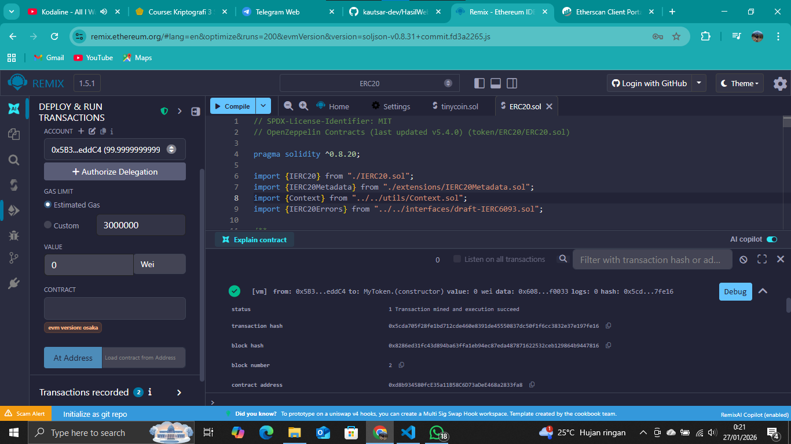

# Laporan Praktikum Kriptografi
Minggu ke-: 15  
Topik: [Proyek Kelompok – TinyCoin ERC20]  
Nama: [Rasya Islami Kautsar]  
NIM: [230202777]  
Kelas: [5IKRB] 

---

## 1. Tujuan

1. Mengembangkan proyek sederhana berbasis algoritma kriptografi.  
2. Mendokumentasikan proses implementasi proyek ke dalam repository Git.  
3. Menyusun laporan teknis hasil proyek akhir.

---

## 2. Dasar Teori

TinyCoin dalam ekosistem ERC-20 merujuk pada aset digital yang dibangun di atas blockchain Ethereum menggunakan standar teknis yang seragam. Sebagai token ERC-20, TinyCoin mengikuti sekumpulan aturan yang memungkinkan interaksi mulus dengan dompet digital, bursa kripto, dan aplikasi terdesentralisasi (dApps) lainnya di jaringan Ethereum. Standar ini memastikan bahwa setiap unit TinyCoin bersifat fungible, artinya satu token memiliki nilai yang identik dengan token lainnya, mirip dengan bagaimana mata uang konvensional bekerja dalam transaksi digital.

TinyCoin memanfaatkan infrastruktur Smart Contract untuk mengelola operasionalnya, mulai dari total pasokan hingga mekanisme transfer antar pengguna. Keunggulan utama dari penggunaan standar ERC-20 adalah keamanan yang diwariskan dari jaringan Ethereum yang sangat kuat serta kemudahan akses bagi para investor melalui platform populer seperti MetaMask atau Uniswap. Proyek ini sering kali ditujukan untuk ekosistem spesifik, seperti ekonomi dalam game berbasis blockchain atau sebagai aset utilitas dalam platform decentralized finance (DeFi) skala kecil yang mengutamakan efisiensi biaya gas.

Eksistensi proyek-proyek seperti TinyCoin sangat bergantung pada kegunaan nyata (utility) dan kemampuan adaptasi terhadap teknologi Layer-2 seperti Polygon atau Arbitrum untuk menekan biaya transaksi. Meskipun memiliki potensi pertumbuhan yang menarik karena kapitalisasi pasarnya yang cenderung kecil, token jenis ini juga membawa risiko volatilitas yang tinggi dibandingkan aset kripto utama. Oleh karena itu, bagi pengguna yang ingin terlibat, pemahaman tentang kontrak pintar dan transparansi tim pengembang menjadi kunci utama dalam mengevaluasi keberlanjutan TinyCoin dalam ekosistem Web3 yang semakin kompetitif.

---

## 3. Alat dan Bahan
  
- Visual Studio Code / editor lain  
- Git dan akun GitHub
- Remix IDE
- Metamask  
- Library tambahan (misalnya pycryptodome, jika diperlukan)  

---

## 4. Langkah Percobaan

- Membuat file TinyCoin.sol di folder contracs pada Remix.IDE
- Menyalin kode program dari panduan praktikum.
- Menjalankan program dengan klik menu compile.
- Melakukan Deploy & run transactions.
- Menguji fungsi balanceOf dan transfer.

---

## 5. Source Code

- **Membuat Kontrak ERC20**

```solidity
// SPDX-License-Identifier: MIT
pragma solidity ^0.8.0;

import "@openzeppelin/contracts/token/ERC20/ERC20.sol";

contract TinyCoin is ERC20 {
    constructor(uint256 initialSupply) ERC20("TinyCoin", "TNC") {
        _mint(msg.sender, initialSupply);
    }
}
```

---

## 6. Hasil dan Pembahasan
- **Hasil eksekusi Membuat Kontrak ERC20**


- **Pembahasan**
Pada praktikum ini berhasil dibuat smart contract TinyCoin berbasis standar ERC-20 menggunakan Solidity dan library OpenZeppelin yang aman dan tepercaya. Kontrak berhasil dikompilasi dan dideploy melalui Remix IDE tanpa error, di mana jumlah token awal langsung diberikan kepada alamat pembuat kontrak. Pengujian fungsi balanceOf menunjukkan saldo token sesuai kepemilikan masing-masing alamat, sedangkan fungsi transfer berhasil memindahkan token antar alamat dengan benar, ditandai dengan berkurangnya saldo pengirim dan bertambahnya saldo penerima. Hasil ini menunjukkan bahwa kontrak TinyCoin telah berfungsi sesuai standar ERC-20 dan dapat digunakan sebagai dasar pengembangan token digital sederhana di jaringan Ethereum.

---

## 7. Jawaban Pertanyaan

1. Apa fungsi utama ERC20 dalam ekosistem blockchain? 

Sebagai aturan umum dalam pembuatan dan penggunaan token agar dapat saling kompatibel. Standar ini menentukan fungsi dasar seperti pengiriman token dan pengecekan saldo, sehingga token ERC20 dapat dengan mudah digunakan di berbagai wallet, exchange, dan aplikasi terdesentralisasi (DApp). Dengan adanya ERC20, pengembang lebih mudah membuat token yang aman, konsisten, dan langsung terintegrasi dalam ekosistem Ethereum.

2. Bagaimana mekanisme transfer token bekerja dalam kontrak ERC20?

Melalui fungsi transfer, di mana pemilik token mengirim sejumlah token ke alamat lain. Kontrak akan mengecek apakah saldo pengirim mencukupi, lalu mengurangi saldo pengirim dan menambahkan saldo penerima sesuai jumlah yang dikirim. Setiap transfer dicatat di blockchain melalui event Transfer, sehingga transaksi dapat diverifikasi secara transparan dan aman.

3. Apa risiko utama dalam implementasi smart contract dan bagaimana cara mitigasinya?

Risiko utama dalam implementasi smart contract meliputi bug kode, celah keamanan (seperti reentrancy atau overflow), serta kesalahan logika yang sulit diperbaiki karena kontrak bersifat immutable. Mitigasinya dapat dilakukan dengan menulis kode sederhana dan jelas, menggunakan library tepercaya seperti OpenZeppelin, melakukan testing menyeluruh, audit keamanan, serta menerapkan pola desain aman (misalnya checks-effects-interactions) sebelum kontrak dideploy ke blockchain.

---

## 8. Kesimpulan

Berdasarkan praktikum yang telah dilakukan, dapat disimpulkan bahwa pembuatan token TinyCoin berbasis standar ERC-20 dapat dilakukan dengan relatif mudah menggunakan smart contract Solidity dan library OpenZeppelin. Standar ERC-20 membantu memastikan kompatibilitas token dengan berbagai wallet dan aplikasi terdesentralisasi di jaringan Ethereum. Melalui pengujian fungsi balanceOf dan transfer, dapat dibuktikan bahwa mekanisme transfer token berjalan dengan aman dan transparan sesuai aturan blockchain.

---

## 9. Daftar Pustaka

- Ethereum Foundation. ERC-20 Token Standard.
https://ethereum.org/en/developers/docs/standards/tokens/erc-20/
- OpenZeppelin. ERC20 Documentation.
https://docs.openzeppelin.com/contracts/erc20
- Remix IDE. Remix – Ethereum IDE.
https://remix.ethereum.org
- Panduan Praktikum Kriptografi Minggu ke-15: Proyek Kelompok – TinyCoin ERC20.

---

## 10. Commit Log

```
commit week15-tinycoin-erc20
Author: Rasya Islami Kautsar <rasyakautsar01@gmail.com>
Date:   2026-01-27

    week15-tinycoin-erc20: Proyek Kelompok – TinyCoin ERC20
```
