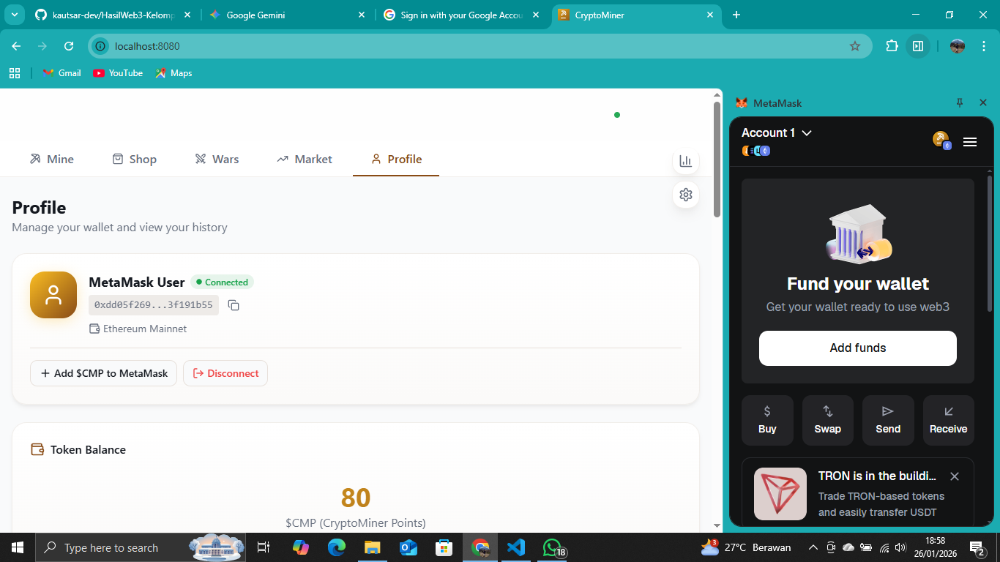
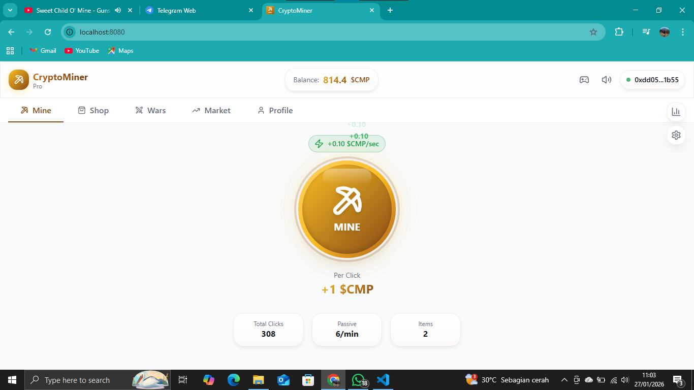
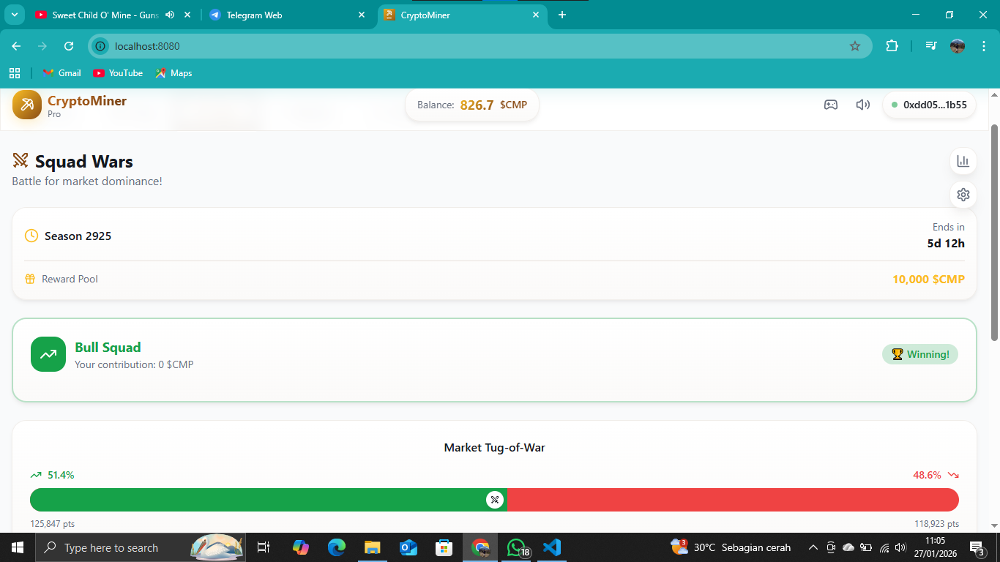
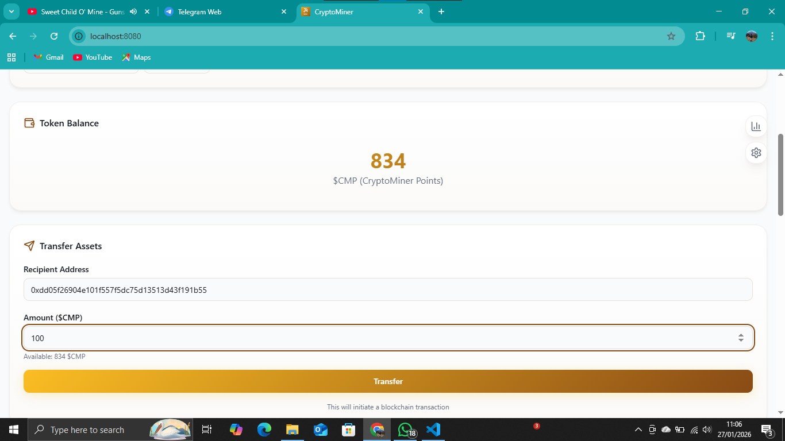
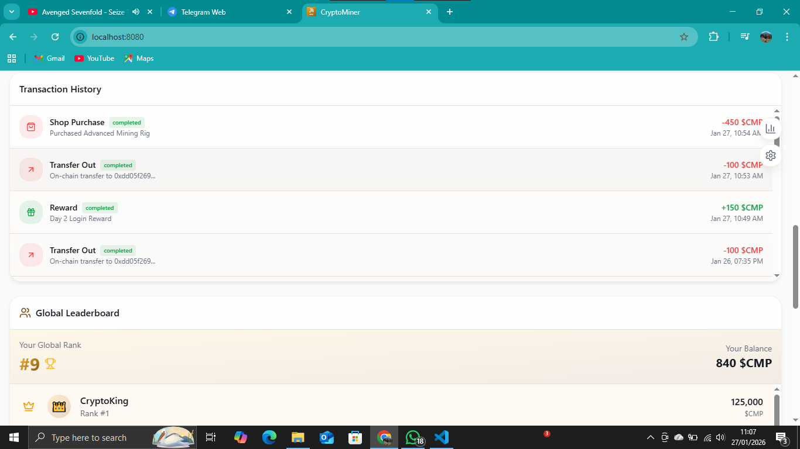

# Laporan Praktikum Kriptografi
Minggu ke-: 16  
Topik: [UAS - Kriptografi-CryptoMiner]  
Nama: [Rasya Islami Kautsar]  
NIM: [230202777]  
Kelas: [5IKRB]  

---

## 1. Tujuan

1. Mengimplementasikan konsep kriptografi dalam aplikasi pembelajaran berbasis web berbasis blockchain untuk memberikan pemahaman praktis kepada pengguna.
2. Menerapkan teknologi blockchain Ethereum melalui smart contract ERC-20 serta penggunaan MetaMask pada jaringan Sepolia Testnet.
3. Mendemonstrasikan penerapan protokol keamanan, termasuk hashing, autentikasi, integritas data, dan transaksi token digital.

---

## 2. Dasar Teori

Blockchain merupakan teknologi buku besar terdisentralisasi (distributed ledger) yang memungkinkan pencatatan transaksi secara transparan, aman, dan tidak dapat diubah. Setiap transaksi yang terjadi akan diverifikasi oleh jaringan dan disimpan dalam blok yang saling terhubung menggunakan teknik kriptografi. Karakteristik utama blockchain seperti transparansi, imutabilitas, dan desentralisasi menjadikannya sangat cocok digunakan dalam sistem yang membutuhkan kepercayaan tinggi, termasuk di bidang pendidikan. Dalam konteks pembelajaran, blockchain dapat digunakan untuk mencatat aktivitas, pencapaian, serta pemberian reward secara adil dan tidak dapat dimanipulasi.

Kriptografi merupakan fondasi utama dalam sistem blockchain yang berfungsi untuk menjaga keamanan, integritas, dan keaslian data. Beberapa konsep penting dalam kriptografi meliputi enkripsi untuk menjaga kerahasiaan data, hashing untuk menjamin integritas informasi, dan tanda tangan digital (digital signature) untuk memastikan keaslian pengirim. Dalam blockchain Ethereum, kriptografi digunakan untuk mengamankan transaksi, memverifikasi identitas pengguna, serta melindungi aset digital seperti token. Pemahaman terhadap kriptografi menjadi sangat penting bagi mahasiswa teknologi informasi agar mampu memahami cara kerja sistem keamanan digital modern.

Smart contract dan token digital merupakan implementasi nyata dari kriptografi dalam teknologi blockchain. Smart contract adalah program yang berjalan di blockchain dan mengeksekusi aturan secara otomatis tanpa perantara, sedangkan token ERC-20 adalah standar aset digital yang dapat ditransfer antar pengguna. Dengan menggunakan jaringan uji seperti Sepolia Testnet, pengembang dan pengguna dapat melakukan simulasi transaksi tanpa menggunakan uang asli. Dalam platform EduToken, smart contract digunakan untuk mengelola pemberian reward berupa token EDU kepada mahasiswa, sehingga mereka dapat belajar konsep kriptografi dan blockchain secara langsung melalui pengalaman praktik.

---

## 3. Alat dan Bahan

- Visual Studio Code
- Akun Github
- Akun Metamask
- Netlify
- Front End menggunakan HTML,CSS,JavaScript
- Blockchain Library
- Smartcontract menggunakan Solidity
- Network menggunakan Ethereum Mainnet

---

## 4. Langkah Percobaan

**Membuka Aplikasi & Menghubungkan Wallet**


- Pengguna membuka aplikasi CryptoMiner di browser dan menghubungkan wallet MetaMask hingga terhubung.

**Melakukan Mining Token**


- Pengguna menekan tombol MINE untuk menambang token $CMP dan melihat saldo bertambah secara manual maupun pasif.

**Pembelian Item di Marketplace**


- Pengguna membeli item seperti Mining Rig atau Multiplier untuk meningkatkan kecepatan mining.

**Mengikuti Squad Wars**


- Pengguna membuka menu Wars untuk bergabung dengan squad dan melihat peringkat kompetisi.

**Transfer Token**


- Pengguna membuka menu Transfer Assets, memasukkan alamat tujuan dan jumlah token, lalu melakukan transfer.

**Melihat Riwayat Transaksi & Leaderboard**


- Pengguna melihat Transaction History untuk mengecek aktivitas dan Global Leaderboard untuk mengetahui peringkat global.

---

## 5. Source Code


---

## 6. Hasil dan Pembahasan

**Hasil dari membuat CryptoMiner**
- https://youtu.be/NANtuUwqukk?si=rySKmMSr6xOnwuI9

Cara Kerja :

- User berinteraksi melalui browser
- Transaksi ditandatangani MetaMask
- Smart contract mengeksekusi logic
- Data tercatat di blockchain

Kelebihan Sistem :

- Terdesentralisasi
- Transparan
- Real-time
- Cocok untuk pembelajaran kriptografi & blockchain

Batas Sistem :

- Nilai token tidak nyata
- Bergantung pada MetaMask
- Belum ada sistem anti-bot
- Tidak menggunakan uang asli
- Hanya untuk simulasi / pembelajaran

---

## 7. Jawaban Pertanyaan

---

## 8. Kesimpulan

Berdasarkan percobaan yang telah dilakukan, aplikasi CryptoMiner berhasil mengimplementasikan konsep kriptografi dan blockchain Ethereum dalam bentuk simulasi pembelajaran berbasis web. Penggunaan smart contract ERC-20, MetaMask, dan mekanisme transaksi token mampu memberikan pemahaman praktis mengenai proses mining, transfer aset digital, serta keamanan transaksi. Secara keseluruhan, sistem ini efektif sebagai media pembelajaran kriptografi dan blockchain meskipun masih terbatas pada lingkungan simulasi dan testnet.

---

## 9. Daftar Pustaka

- Katz, J., & Lindell, Y. Introduction to Modern Cryptography. Chapman & Hall/CRC, 2014.
- Stallings, W. Cryptography and Network Security: Principles and Practice. Pearson Education, 2017.
- Ethereum Foundation. Ethereum Documentation
- OpenZeppelin. ERC-20 Token Standard Documentation.
- MetaMask. MetaMask Official Documentation.

---

## 10. Commit Log

```
commit week16-uas
Author: Rasya Islami Kautsar <rasyakautsar01@gmail.com>
Date:   2026-01-27

    week16-uas: UAS - (Kriptografi-CryptoMiner)
```
