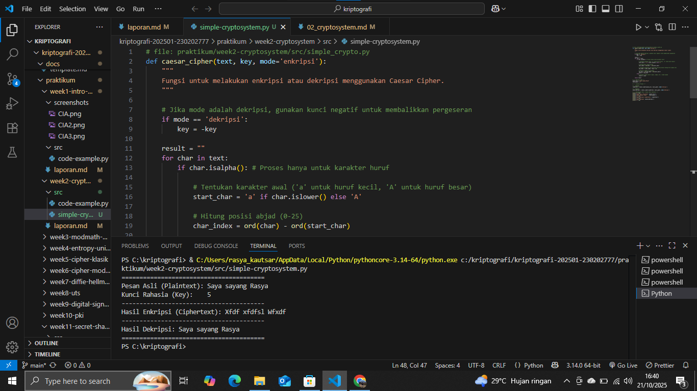

# Laporan Praktikum Kriptografi
Minggu ke-: 2  
Topik: [cryptosystem]  
Nama: [Rasya Islami Kautsar]  
NIM: [230202777]  
Kelas: [5IKRB]  

---

## 1. Tujuan

Setelah mengikuti praktikum ini, mahasiswa diharapkan mampu:  
1. Mengidentifikasi komponen dasar kriptosistem (plaintext, ciphertext, kunci, algoritma).  
2. Menggambarkan proses enkripsi dan dekripsi sederhana.  
3. Mengklasifikasikan jenis kriptosistem (simetris dan asimetris).  

---

## 2. Dasar Teori

**Diagram/skema kriptosistem dasar**
- 

**Implementasi program sederhana simulasi enkripsi–dekripsi**

```
# file: praktikum/week2-cryptosystem/src/simple-cryptosystem.py
def caesar_cipher(text, key, mode='enkripsi'):
    """
    Fungsi untuk melakukan enkripsi atau dekripsi menggunakan Caesar Cipher.
    """
    
    # Jika mode adalah dekripsi, gunakan kunci negatif untuk membalikkan pergeseran
    if mode == 'dekripsi':
        key = -key
    
    result = ""
    for char in text:
        if char.isalpha(): # Proses hanya untuk karakter huruf
            
            # Tentukan karakter awal ('a' untuk huruf kecil, 'A' untuk huruf besar)
            start_char = 'a' if char.islower() else 'A'
            
            # Hitung posisi abjad (0-25)
            char_index = ord(char) - ord(start_char)
            
            # Terapkan pergeseran dan pastikan hasilnya dalam rentang 0-25 (modulo 26)
            new_index = (char_index + key) % 26
            
            # Konversi kembali ke karakter
            new_char = chr(new_index + ord(start_char))
            result += new_char
        else:
            # Karakter selain huruf (spasi, angka, dll.) tidak diubah
            result += char
            
    return result

# --- Data Uji Coba ---
pesan_asli = "Saya sayang Rasya"
kunci_geser = 5 

# --- Simulasi Proses ---

# 1. ENKRIPSI
ciphertext = caesar_cipher(pesan_asli, kunci_geser, mode='enkripsi')

# 2. DEKRIPSI
pesan_dekripsi = caesar_cipher(ciphertext, kunci_geser, mode='dekripsi')

# --- Menampilkan Hasil (Tanpa Judul Simulasi) ---
print("=" * 40)
print(f"Pesan Asli (Plaintext): {pesan_asli}")
print(f"Kunci Rahasia (Key):    {kunci_geser}")
print("-" * 40)
print(f"Hasil Enkripsi (Ciphertext): {ciphertext}")
print("-" * 40)
print(f"Hasil Dekripsi: {pesan_dekripsi}")
print("=" * 40)
```


**Hasil uji coba (Output program)**

```
========================================
Pesan Asli (Plaintext): Saya sayang Rasya
Kunci Rahasia (Key):    5
----------------------------------------
Hasil Enkripsi (Ciphertext): Vdyd vdydug Wfxyd
----------------------------------------
Hasil Dekripsi: Saya sayang Rasya
========================================
```

**Klasifikasi Simetris & Asimetris**
1. Simetris
   Kriptosistem simetris menggunakan satu kunci yang sama untuk mengenkripsi dan mendekripsi pesan. Keduanya (pengirim dan penerima) harus memiliki kunci rahasia yang sama.
 
   Contoh Algoritma:
    - AES (Advanced Encryption Standard)
      Digunakan untuk mengamankan data pada aplikasi seperti WhatsApp dan Wi-Fi (WPA2/WPA3).
      Misalnya, pesan “HELLO” dienkripsi dengan kunci “KUNCI123” dan hanya bisa dibuka kembali menggunakan kunci yang sama.
    - DES (Data Encryption Standard)
      Dulu digunakan dalam sistem perbankan dan ATM untuk mengenkripsi PIN atau data transaksi, tetapi sekarang sudah jarang dipakai karena keamanannya dianggap kurang kuat.
2. Asimetris
   Kriptosistem asimetris menggunakan dua kunci berbeda, yaitu kunci publik (untuk enkripsi) dan kunci privat (untuk dekripsi). Hanya pemilik kunci privat yang bisa membuka pesan yang dikunci dengan kunci publiknya.

   Contoh Algoritma: 
    - RSA (Rivest–Shamir–Adleman)
      Digunakan dalam HTTPS, email terenkripsi (PGP), dan tanda tangan digital untuk mengamankan komunikasi di internet.
    - ECC (Elliptic Curve Cryptography)
      Banyak digunakan pada perangkat mobile dan dompet kripto (cryptocurrency wallets) karena tingkat keamanannya tinggi dengan ukuran kunci yang lebih kecil.

**Komponen Kriptosistem**
1. Plaintext
   Merupakan pesan atau data asli yang ingin diamankan sebelum dienkripsi. Plaintext masih dapat dibaca dan dipahami oleh siapa pun.
2. Ciphertext
   Adalah hasil dari proses enkripsi terhadap plaintext. Bentuknya berupa teks acak yang tidak dapat dibaca tanpa kunci yang benar.
3. Algoritma Enkripsi dan Dekripsi
   Algoritma enkripsi digunakan untuk mengubah plaintext menjadi ciphertext, sedangkan algoritma dekripsi digunakan untuk mengembalikan ciphertext menjadi plaintext.
4. Kunci (Key)
   Nilai rahasia yang digunakan dalam proses enkripsi dan dekripsi. Pada sistem simetris digunakan satu kunci yang sama, sedangkan pada sistem asimetris digunakan dua kunci, yaitu kunci publik dan kunci privat.

---

## 3. Alat dan Bahan

- Python 3.x
- Visual Studio Code
- Git dan akun GitHub
- Google chrome
- Library tambahan (misalnya pycryptodome, jika diperlukan)

---

## 4. Langkah Percobaan

1. Membuat file simple-cryptosystem.py di folder praktikum/week2-cryptosystem/src/.
2. Menyalin kode program dari panduan praktikum.
3. Menjalankan program dengan perintah python simple-cryptosystem.py.
4. Membuat ringkasan perbedaan antara kriptosistem simetris dan asimetris.
5. Mengaploud hasil eksekusi di folder praktikum/week2-cryptosistem/screenshots/
6. Menjawab pertanyaan diskusi.

---

## 5. Source Code

```
# file: praktikum/week2-cryptosystem/src/simple_crypto.py
def caesar_cipher(text, key, mode='enkripsi'):
    """
    Fungsi untuk melakukan enkripsi atau dekripsi menggunakan Caesar Cipher.
    """
    
    # Jika mode adalah dekripsi, gunakan kunci negatif untuk membalikkan pergeseran
    if mode == 'dekripsi':
        key = -key
    
    result = ""
    for char in text:
        if char.isalpha(): # Proses hanya untuk karakter huruf
            
            # Tentukan karakter awal ('a' untuk huruf kecil, 'A' untuk huruf besar)
            start_char = 'a' if char.islower() else 'A'
            
            # Hitung posisi abjad (0-25)
            char_index = ord(char) - ord(start_char)
            
            # Terapkan pergeseran dan pastikan hasilnya dalam rentang 0-25 (modulo 26)
            new_index = (char_index + key) % 26
            
            # Konversi kembali ke karakter
            new_char = chr(new_index + ord(start_char))
            result += new_char
        else:
            # Karakter selain huruf (spasi, angka, dll.) tidak diubah
            result += char
            
    return result

# --- Data Uji Coba ---
pesan_asli = "Saya sayang Rasya"
kunci_geser = 5 

# --- Simulasi Proses ---

# 1. ENKRIPSI
ciphertext = caesar_cipher(pesan_asli, kunci_geser, mode='enkripsi')

# 2. DEKRIPSI
pesan_dekripsi = caesar_cipher(ciphertext, kunci_geser, mode='dekripsi')

# --- Menampilkan Hasil (Tanpa Judul Simulasi) ---
print("=" * 40)
print(f"Pesan Asli (Plaintext): {pesan_asli}")
print(f"Kunci Rahasia (Key):    {kunci_geser}")
print("-" * 40)
print(f"Hasil Enkripsi (Ciphertext): {ciphertext}")
print("-" * 40)
print(f"Hasil Dekripsi: {pesan_dekripsi}")
print("=" * 40)
```

---

## 6. Hasil dan Pembahasan

**Diagram/skema kriptosistem dasar**
- 

**Hasil uji coba (Output program)**
- 

---

## 7. Jawaban Pertanyaan

1. Sebutkan komponen utama dalam sebuah kriptosistem.

    - Plaintext : Merupakan pesan atau data asli yang ingin diamankan sebelum dienkripsi. Plaintext masih dapat dibaca dan dipahami oleh siapa pun.
    - Ciphertext : Adalah hasil dari proses enkripsi terhadap plaintext. Bentuknya berupa teks acak yang tidak dapat dibaca tanpa kunci yang benar.
    - Algoritma Enkripsi dan Dekripsi : Algoritma enkripsi digunakan untuk mengubah plaintext menjadi ciphertext, sedangkan algoritma dekripsi digunakan untuk mengembalikan ciphertext menjadi plaintext.
    - Kunci (Key) : Nilai rahasia yang digunakan dalam proses enkripsi dan dekripsi. Pada sistem simetris digunakan satu kunci yang sama, sedangkan pada sistem asimetris digunakan dua kunci, yaitu kunci publik dan kunci privat.
2. Apa kelebihan dan kelemahan sistem simetris dibandingkan asimetris?

**Sistem Simetris**
- Kelebihan: Sistem ini sangat cepat dalam enkripsi dan dekripsi, sehingga ideal untuk mengamankan data dalam jumlah besar (enkripsi massal) karena algoritmanya yang lebih sederhana.
- Kelemahan: Masalah utamanya adalah distribusi kunci. Kunci rahasia yang sama harus dibagikan secara aman kepada penerima, yang sangat sulit dilakukan. Selain itu, sistem ini tidak secara inheren menyediakan otentikasi.

**Sistem Asimetris**
- Kelebihan: Memberikan keamanan yang lebih tinggi dalam pertukaran kunci, karena kunci publik dapat dibagikan secara bebas. Sistem ini juga memungkinkan tanda tangan digital untuk memverifikasi identitas pengirim (otentikasi).
- Kelemahan: Sistem ini sangat lambat dan membutuhkan daya komputasi yang jauh lebih besar karena menggunakan algoritma yang kompleks dan kunci yang lebih panjang. Oleh karena itu, tidak cocok untuk mengenkripsi data dalam jumlah besar.
3. Mengapa distribusi kunci menjadi masalah utama dalam kriptografi simetris?

Karena pengirim dan penerima harus menggunakan kunci rahasia yang sama, dan kunci tersebut harus dikirim terlebih dahulu dengan cara yang aman. Jika kunci dikirim melalui saluran yang tidak aman, pihak ketiga (penyadap) bisa mencurinya dan mendekripsi seluruh komunikasi. Semakin banyak pengguna, semakin sulit mengelola dan menjaga kerahasiaan semua kunci.

---

## 8. Kesimpulan

Kriptosistem terdiri dari empat komponen utama, yaitu plaintext, ciphertext, algoritma enkripsi/dekripsi, dan kunci. Melalui simulasi Caesar Cipher, mahasiswa memahami proses enkripsi dan dekripsi sederhana menggunakan kunci yang sama (simetris). Selain itu, diperoleh pemahaman bahwa kriptosistem simetris lebih cepat namun bermasalah dalam distribusi kunci, sedangkan asimetris lebih aman untuk pertukaran kunci namun lebih lambat dalam prosesnya.

---

## 9. Daftar Pustaka

- Katz, J., & Lindell, Y. (2007). Introduction to Modern Cryptography. CRC Press.
- Stallings, W. (2017). Cryptography and Network Security: Principles and Practice (7th ed.). Pearson Education.
- Schneier, B. (1996). Applied Cryptography: Protocols, Algorithms, and Source Code in C (2nd ed.). Wiley.
- Menezes, A. J., van Oorschot, P. C., & Vanstone, S. A. (1996). Handbook of Applied Cryptography. CRC Press.

---

## 10. Commit Log

```
commit abc12345
Author: Rasya Islami Kautsar <rasyakautsar01@gmail.com>
Date:   2025-10-20

    week2-cryptosystem: Komponen, Enkripsi & Dekripsi, Simetris & Asimetris 
```
