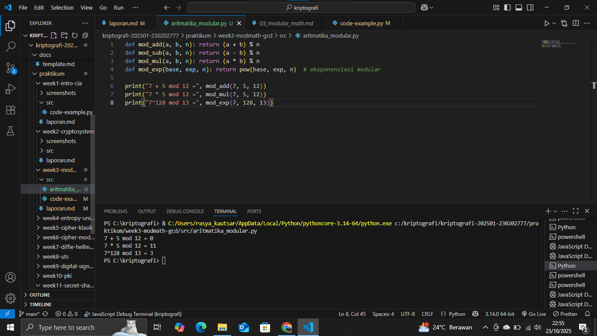
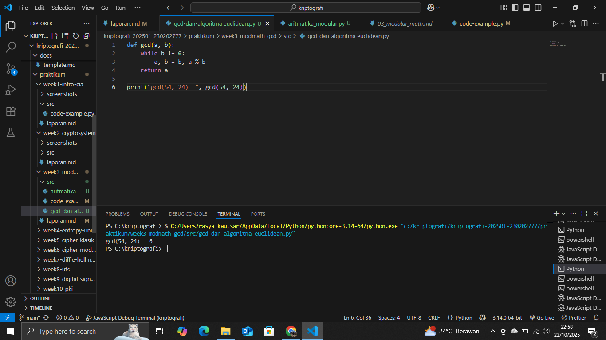
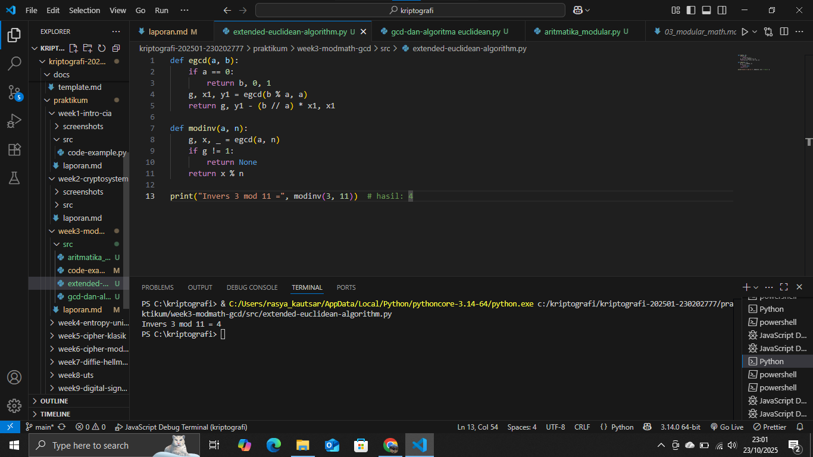
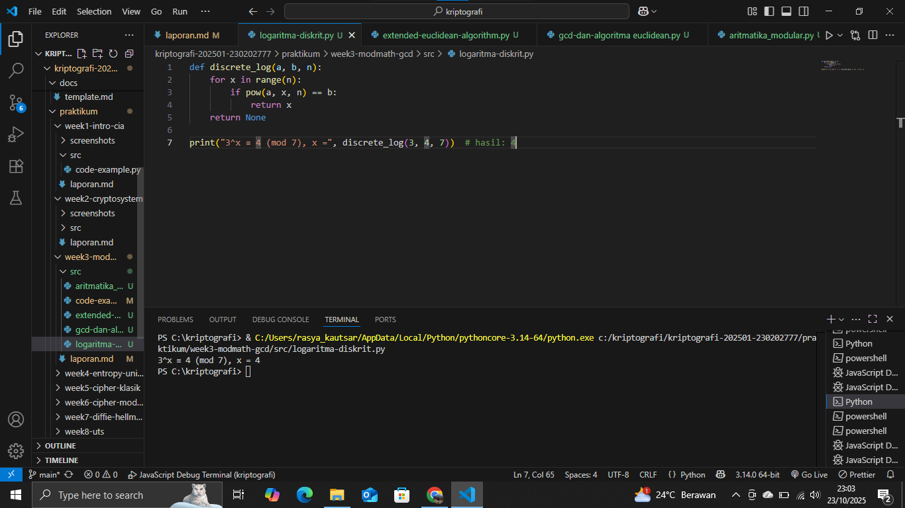

# Laporan Praktikum Kriptografi
Minggu ke-: 3  
Topik: [Modular Math]  
Nama: [Rasya Islami Kautsar]  
NIM: [230202777]  
Kelas: [5IKRB]  

---

## 1. Tujuan

1. Menyelesaikan operasi aritmetika modular.  
2. Menentukan bilangan prima dan menghitung GCD (Greatest Common Divisor).  
3. Menerapkan logaritma diskrit sederhana dalam simulasi kriptografi.

---

## 2. Dasar Teori

- **Langkah 1 — Aritmetika Modular**
```
def mod_add(a, b, n): return (a + b) % n
def mod_sub(a, b, n): return (a - b) % n
def mod_mul(a, b, n): return (a * b) % n
def mod_exp(base, exp, n): return pow(base, exp, n)  # eksponensiasi modular

print("7 + 5 mod 12 =", mod_add(7, 5, 12))
print("7 * 5 mod 12 =", mod_mul(7, 5, 12))
print("7^128 mod 13 =", mod_exp(7, 128, 13))
```

**Hasil uji coba (Output program)**
```
7 + 5 mod 12 = 0
7 * 5 mod 12 = 11
7^128 mod 13 = 3
```

- **Langkah 2 — GCD & Algoritma Euclidean**
```
def gcd(a, b):
    while b != 0:
        a, b = b, a % b
    return a

print("gcd(54, 24) =", gcd(54, 24))
```

**Hasil uji coba (Output program)**
```
gcd(54, 24) = 6
```

- **Langkah 3 — Extended Euclidean Algorithm**
```
def egcd(a, b):
    if a == 0:
        return b, 0, 1
    g, x1, y1 = egcd(b % a, a)
    return g, y1 - (b // a) * x1, x1

def modinv(a, n):
    g, x, _ = egcd(a, n)
    if g != 1:
        return None
    return x % n

print("Invers 3 mod 11 =", modinv(3, 11))  # hasil: 4
```

**Hasil uji coba (Output program)**
```
Invers 3 mod 11 = 4
```

- **Langkah 4 — Logaritma Diskrit (Discrete Log)**
```
def discrete_log(a, b, n):
    for x in range(n):
        if pow(a, x, n) == b:
            return x
    return None

print("3^x ≡ 4 (mod 7), x =", discrete_log(3, 4, 7))  # hasil: 4
```

**Hasil uji coba (Output program)**
```
3^x ≡ 4 (mod 7), x = 4
```

---

## 3. Alat dan Bahan

- Python 3.x
- Visual Studio Code
- Git dan akun GitHub
- Google chrome
- Library tambahan (misalnya pycryptodome, jika diperlukan)

---

## 4. Langkah Percobaan

1. Membuat file dengan nama aritmatika_modular.py di folder praktikum/week3-modmath/src/.
2. Membuat file dengan nama gcd-dan-algoritma euclidean.py di folder praktikum/week3-modmath/src/.
3. Membuat file dengan nama extended-euclidean-algorithm.py di folder praktikum/week3-modmath/src/.
4. Membuat file dengan nama logaritma-diskrit.py di folder praktikum/week3-modmath/src/.
6. Menyalin kode program dari panduan praktikum.
7. Menjalankan program dengan perintah sesuai nama file.

---

## 5. Source Code

- **Langkah 1 — Aritmetika Modular**
```
def mod_add(a, b, n): return (a + b) % n
def mod_sub(a, b, n): return (a - b) % n
def mod_mul(a, b, n): return (a * b) % n
def mod_exp(base, exp, n): return pow(base, exp, n)  # eksponensiasi modular

print("7 + 5 mod 12 =", mod_add(7, 5, 12))
print("7 * 5 mod 12 =", mod_mul(7, 5, 12))
print("7^128 mod 13 =", mod_exp(7, 128, 13))
```

- **Langkah 2 — GCD & Algoritma Euclidean**
```
def gcd(a, b):
    while b != 0:
        a, b = b, a % b
    return a

print("gcd(54, 24) =", gcd(54, 24))
```

- **Langkah 3 — Extended Euclidean Algorithm**
```
def egcd(a, b):
    if a == 0:
        return b, 0, 1
    g, x1, y1 = egcd(b % a, a)
    return g, y1 - (b // a) * x1, x1

def modinv(a, n):
    g, x, _ = egcd(a, n)
    if g != 1:
        return None
    return x % n

print("Invers 3 mod 11 =", modinv(3, 11))  # hasil: 4
```

- **Langkah 4 — Logaritma Diskrit (Discrete Log)**
```
def discrete_log(a, b, n):
    for x in range(n):
        if pow(a, x, n) == b:
            return x
    return None

print("3^x ≡ 4 (mod 7), x =", discrete_log(3, 4, 7))  # hasil: 4
```

---

## 6. Hasil dan Pembahasan

- **Hasil eksekusi Langkah 1 — Aritmetika Modular**


- **Hasil eksekusi Langkah 2 — GCD & Algoritma Euclidean**


- **Hasil eksekusi Langkah 3 — Extended Euclidean Algorithm**


- **Hasil eksekusi Langkah 4 — Logaritma Diskrit (Discrete Log)**


---

## 7. Jawaban Pertanyaan

1. Apa peran aritmetika modular dalam kriptografi modern?

Peran aritmetika modular dalam kriptografi modern adalah fundamental dan krusial, berfungsi sebagai tulang punggung matematis yang memungkinkan keamanan dan fungsionalitas sistem kunci publik (asimetris) dan banyak algoritma penting lainnya.

2. Mengapa invers modular penting dalam algoritma kunci publik (misalnya RSA)? 

Invers modular berperan penting dalam algoritma kunci publik seperti RSA karena memungkinkan proses dekripsi menjadi kebalikan dari enkripsi. Tanpa invers modular, kunci privat tidak dapat dihitung, sehingga pesan yang dienkripsi tidak bisa dikembalikan ke bentuk aslinya.

3. Apa tantangan utama dalam menyelesaikan logaritma diskrit untuk modulus besar?  

Karena perhitungannya sangat kompleks dan tidak efisien, menjadikannya masalah yang sulit dipecahkan dan menjadi dasar keamanan banyak sistem kriptografi modern seperti Diffie-Hellman dan ElGamal.

---

## 8. Kesimpulan

Percobaan ini berhasil menunjukkan penerapan dasar-dasar aritmetika modular dan teori bilangan yang menjadi fondasi kriptografi modern. Kami berhasil menyelesaikan operasi modular dasar, menentukan GCD menggunakan Algoritma Euclidean, menghitung invers modular yang krusial untuk pembangkitan kunci privat (seperti di RSA), dan menemukan solusi logaritma diskrit sederhana. Ketidakpraktisan komputasi dalam memecahkan masalah logaritma diskrit untuk bilangan besar ditegaskan, yang sekaligus menjelaskan mengapa konsep ini menjadi pilar keamanan pada sistem kriptografi kunci publik.

---

## 9. Daftar Pustaka

- Munir, R. (2021). Matematika Diskrit. Edisi Keenam. Bandung: Informatika Bandung. (Mencakup Teori Bilangan, Aritmetika Modular, dan Algoritma Euclidean).
- Stallings, W. (2020). Cryptography and Network Security: Principles and Practice. Edisi Kedelapan. Pearson. (Mencakup aplikasi RSA, Diffie-Hellman, dan Invers Modular).
- Python Official Documentation (Untuk fungsi pow(base, exp, mod) yang digunakan dalam eksponensiasi modular).

---

## 10. Commit Log

```
commit abc12345
Author: Rasya Islami Kautsar <rasya_kautsar01@gmail.com>
Date:   2025-10-24

    week3-modmath-gcd: Modular Math (Aritmetika Modular, GCD, Bilangan Prima, Logaritma Diskrit)   
```
