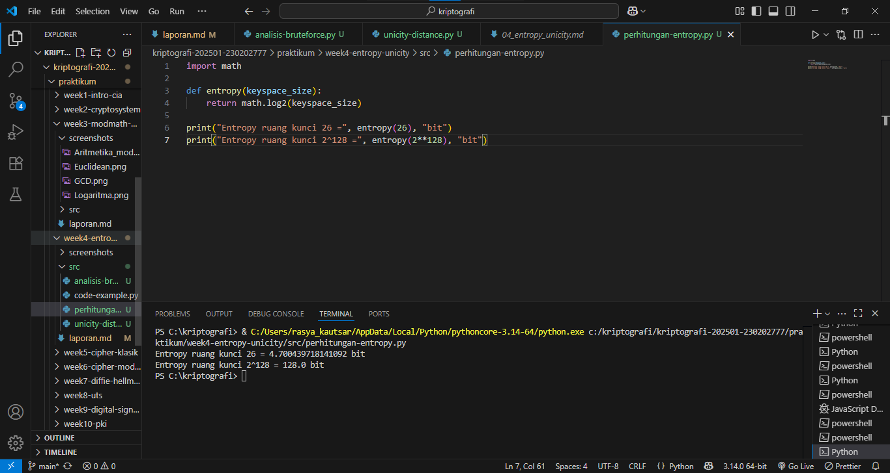
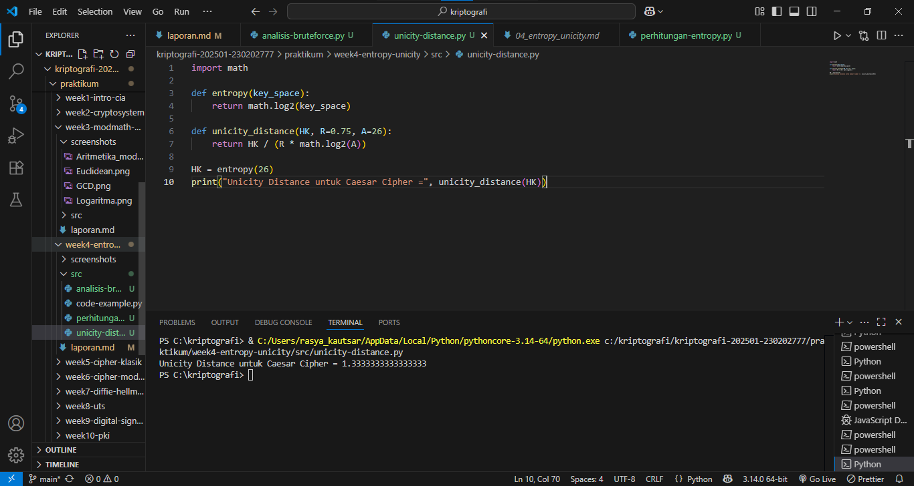
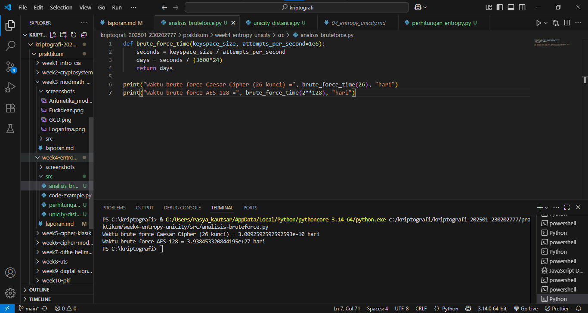

# Laporan Praktikum Kriptografi
Minggu ke-: 4  
Topik: [Entropy & Unicity Distance]  
Nama: [Rasya Islami Kautsar]  
NIM: [230202777]  
Kelas: [5IKRB] 

---

## 1. Tujuan

1. Menyelesaikan perhitungan sederhana terkait entropi kunci.  
2. Menggunakan teorema Euler pada contoh perhitungan modular & invers.  
3. Menghitung **unicity distance** untuk ciphertext tertentu.  
4. Menganalisis kekuatan kunci berdasarkan entropi dan unicity distance.  
5. Mengevaluasi potensi serangan brute force pada kriptosistem sederhana.)

---

## 2. Dasar Teori

Entropi dalam kriptografi menggambarkan tingkat keacakan atau ketidakpastian suatu kunci. Semakin tinggi entropi, semakin sulit kunci tersebut ditebak, sehingga meningkatkan keamanan terhadap serangan brute force. Kunci dengan entropi penuh memiliki jumlah kemungkinan yang sangat besar.

Sementara itu, unicity distance menunjukkan jumlah minimum ciphertext yang diperlukan untuk secara unik menentukan kunci yang digunakan. Nilai ini dipengaruhi oleh panjang kunci dan redundansi plaintext. Jika ciphertext yang tersedia melebihi unicity distance, kunci dapat ditemukan melalui analisis statistik.

Kombinasi entropi tinggi dan unicity distance besar menunjukkan sistem kriptografi yang kuat, karena sulit dipecahkan baik melalui brute force maupun analisis ciphertext. Oleh sebab itu, pemilihan ukuran kunci yang memadai dan pengelolaan kunci yang aman sangat penting dalam menjaga keamanan data pada sistem kriptografi modern.

---

## 3. Alat dan Bahan

- Python 3.x
- Visual Studio Code
- Git dan akun GitHub
- Google chrome
- Library tambahan (misalnya pycryptodome, jika diperlukan)

---

## 4. Langkah Percobaan

1. Membuat file perhitungan-entropy.py di folder praktikum/week4-entropy-unicity/src/.
2. Membuat file menghitung unicity-distance.py di folder praktikum/week4-entropy-unicity/src/.
3. Membuat file analisis-bruteforce.py di folder praktikum/week4-entropy-unicity/src/.
4. Menyalin kode program dari panduan praktikum.
5. Menjalankan program dengan perintah sesuai nama file.

---

## 5. Source Code

- **Langkah 1 — Perhitungan Entropi**
```
import math

def entropy(keyspace_size):
    return math.log2(keyspace_size)

print("Entropy ruang kunci 26 =", entropy(26), "bit")
print("Entropy ruang kunci 2^128 =", entropy(2**128), "bit")
```

**Hasil uji coba (Output program)**
```
Entropy ruang kunci 26 = 4.700439718141092 bit
Entropy ruang kunci 2^128 = 128.0 bit
```

- **Langkah 2 — Menghitung Unicity Distance**
```
import math

def entropy(key_space):
    return math.log2(key_space)

def unicity_distance(HK, R=0.75, A=26):
    return HK / (R * math.log2(A))

HK = entropy(26)
print("Unicity Distance untuk Caesar Cipher =", unicity_distance(HK))
```

**Hasil uji coba (Output program)**
```
Unicity Distance untuk Caesar Cipher = 1.3333333333333333
```

- **Langkah 3 — Analisis Brute Force**
```
def brute_force_time(keyspace_size, attempts_per_second=1e6):
    seconds = keyspace_size / attempts_per_second
    days = seconds / (3600*24)
    return days

print("Waktu brute force Caesar Cipher (26 kunci) =", brute_force_time(26), "hari")
print("Waktu brute force AES-128 =", brute_force_time(2**128), "hari")
```

**Hasil uji coba (Output program)**
```
Waktu brute force Caesar Cipher (26 kunci) = 3.0092592592592593e-10 hari
Waktu brute force AES-128 = 3.938453320844195e+27 hari
```

---

## 6. Hasil dan Pembahasan

- **Hasil eksekusi Langkah 1 — Perhitungan Entropi**


- **Hasil eksekusi Langkah 2 — Menghitung Unicity Distance**


- **Hasil eksekusi Langkah 3 — Analisis Brute Force**


**Pembahasan:**

Dari hasil percobaan, dapat dilihat bahwa entropi menentukan seberapa besar ruang kemungkinan kunci yang tersedia. Caesar Cipher hanya memiliki entropi sekitar 4,7 bit, sedangkan AES-128 memiliki entropi 128 bit, menunjukkan perbedaan kekuatan kunci yang sangat besar.

Nilai unicity distance Caesar Cipher sebesar 1,33 menunjukkan bahwa hanya dengan sedikit ciphertext, kunci sudah dapat ditemukan secara unik. Ini menandakan cipher tersebut sangat lemah terhadap analisis kriptografi.

Hasil analisis brute force juga memperkuat bahwa Caesar Cipher bisa dipecahkan dalam waktu sangat singkat, sedangkan AES-128 membutuhkan waktu lebih lama dari usia alam semesta. Dengan demikian, dapat disimpulkan bahwa semakin besar entropi dan unicity distance, semakin kuat sistem kriptografi terhadap serangan brute force maupun analisis ciphertext.

---

## 7. Jawaban Pertanyaan

1. Apa arti dari nilai **entropy** dalam konteks kekuatan kunci?

Entropy menggambarkan tingkat ketidakpastian atau keacakan dalam sistem kunci. Semakin tinggi nilai entropi, semakin sulit bagi penyerang untuk menebak kunci yang benar.

2. Mengapa unicity distance penting dalam menentukan keamanan suatu cipher?

Karena sebagai ukuran tingkat keamanan cipher terhadap analisis statistik. Jika cipher memiliki unicity distance tinggi, maka meskipun penyerang memiliki banyak data terenkripsi, mereka belum tentu bisa menemukan kunci yang benar dengan pasti.

3. Mengapa brute force masih menjadi ancaman meskipun algoritma sudah kuat?

Karena faktor kunci dan implementasi manusia sering kali tidak seaman algoritmanya sendiri. Jadi, keamanan tidak hanya bergantung pada algoritma, tetapi juga pada cara algoritma itu digunakan dan dikelola.

---

## 8. Kesimpulan

Berdasarkan hasil percobaan dan analisis, dapat disimpulkan bahwa entropi kunci adalah metrik krusial yang mengukur tingkat ketidakpastian ruang kunci. Semakin tinggi entropi, semakin besar ruang kunci(keyspace), yang secara langsung meningkatkan keamanan terhadap serangan brute force.
Secara keseluruhan, kekuatan kriptosistem ditentukan oleh kombinasi entropi kunci yang tinggi untuk menahan brute force dan unicity distance yang besar untuk menahan analisis ciphertext. Keamanan tidak hanya bergantung pada algoritma yang kuat, tetapi juga pada pemilihan ukuran kunci yang memadai dan implementasi yang aman.

---

## 9. Daftar Pustaka

- Stallings, William. Cryptography and Network Security: Principles and Practice. Edisi ke-8. Pearson Education, 2020.
- Schneier, Bruce. Applied Cryptography: Protocols, Algorithms, and Source Code in C. Edisi ke-2. John Wiley & Sons, 1996.
- Sumber referensi perkuliahan/modul praktikum terkait Entropi dan Unicity Distance.

---

## 10. Commit Log

```
commit abc12345
Author: Rasya Islami Kautsar <rasyakautsar01@gmail.com>
Date:   2025-10-30

    week4-entropy-unicity: Entropy & Unicity Distance (Evaluasi Kekuatan Kunci dan Brute Force)
```
