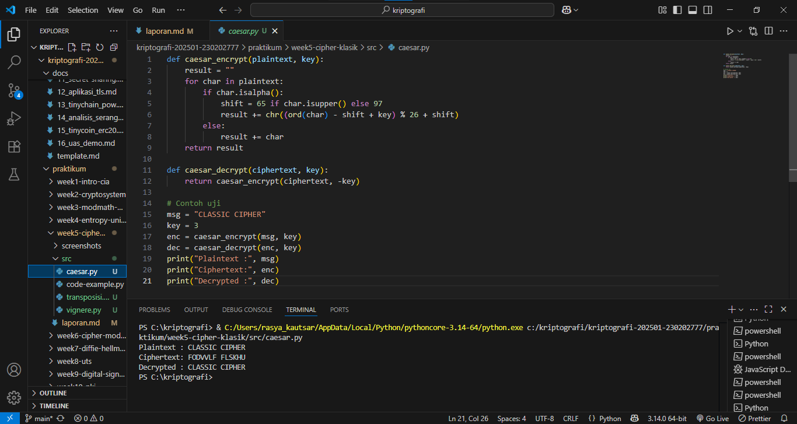
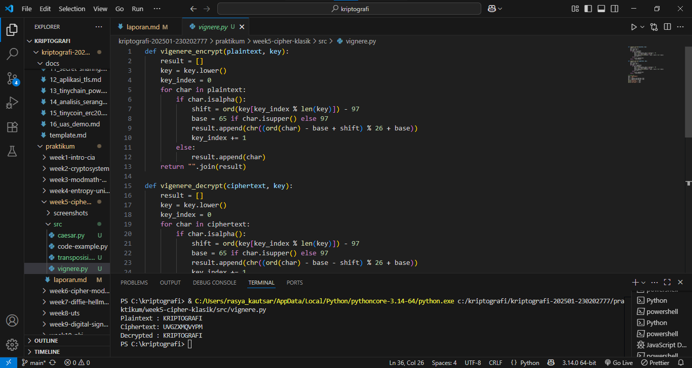
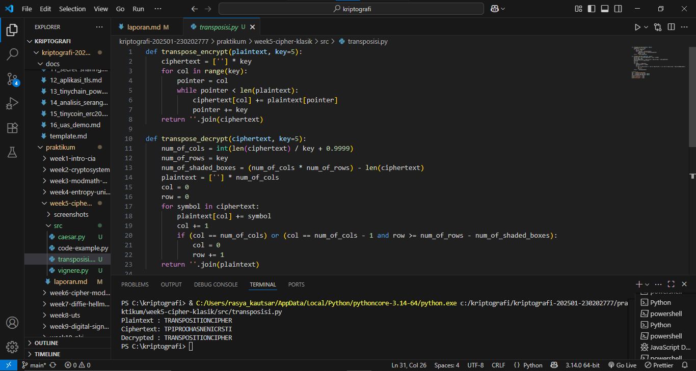

# Laporan Praktikum Kriptografi
Minggu ke-: 5  
Topik: [Cipher Klasik]  
Nama: [Rasya Islami Kautsar]  
NIM: [230202777]  
Kelas: [5IKRB] 

---

## 1. Tujuan

1. Menerapkan algoritma **Caesar Cipher** untuk enkripsi dan dekripsi teks.  
2. Menerapkan algoritma **Vigenère Cipher** dengan variasi kunci.  
3. Mengimplementasikan algoritma transposisi sederhana.  
4. Menjelaskan kelemahan algoritma kriptografi klasik.

---

## 2. Dasar Teori

Cipher Klasik adalah pondasi historis kriptografi yang dapat dibagi menjadi dua mekanisme utama: Substitusi dan Transposisi. Dalam kategori substitusi, Cipher Caesar adalah contoh paling dasar, menggunakan satu pergeseran alfabet yang tetap (monoaalfabetik) untuk mengganti setiap huruf plaintext. Karena hanya memiliki 25 kunci yang mungkin, Caesar sangat rentan terhadap serangan brute-force atau analisis frekuensi sederhana. Untuk meningkatkan kerahasiaan, dikembangkan Cipher Vigenère, sebuah sistem substitusi polialfabetik yang menggunakan kata kunci untuk menerapkan serangkaian pergeseran Caesar yang berbeda secara berulang. Ini menyamarkan frekuensi huruf asli, menjadikannya lebih kuat daripada Caesar.

Meskipun Vigenère lebih aman daripada Caesar, ia masih termasuk dalam substitusi, dan keamanannya bergantung pada kerahasiaan kata kunci dan panjangnya. Vigenère rentan terhadap metode analisis yang dirancang untuk menemukan panjang kata kunci, seperti Tes Coincidence atau Serangan Kasiski. Setelah panjang kunci ditemukan, ciphertext dapat dibagi menjadi beberapa cipher Caesar yang terpisah, yang kemudian dapat dipecahkan satu per satu. Oleh karena itu, semua cipher substitusi klasik akhirnya rentan terhadap analisis yang mengeksploitasi pola bahasa dan frekuensi kemunculan huruf.

Berbeda dengan substitusi, Cipher Transposisi (misalnya, Transposisi Kolom) bekerja dengan cara mengacak atau mengubah urutan posisi huruf dalam plaintext tanpa mengubah hurufnya sendiri. Teks asli disusun ulang berdasarkan pola tertentu (sering kali dikendalikan oleh kata kunci) untuk menghasilkan ciphertext. Walaupun transposisi tampak mengacak huruf secara total, pola dan panjang plaintext serta frekuensi hurufnya tetap terjaga, yang menjadi kelemahan dalam analisis lanjutan. Secara keseluruhan, baik substitusi maupun transposisi klasik telah ditinggalkan dalam keamanan modern karena mudah dipecahkan oleh komputer atau bahkan secara manual dengan metode analisis statistik.

---

## 3. Alat dan Bahan

- Python 3.x
- Visual Studio Code
- Git dan akun GitHub
- Google chrome
- Library tambahan (misalnya pycryptodome, jika diperlukan)

---

## 4. Langkah Percobaan

1. Membuat file caesar.py di folder praktikum/week5-cipher-klasik/src/.
2. Membuat file vignere.py di folder praktikum/week5-cipher-klasik/src/.
3. Membuat file transposisi.py di folder praktikum/week5-cipher-klasik/src/.
4. Menyalin kode program dari panduan praktikum.
5. Menjalankan program dengan perintah sesuai pada file.

---

## 5. Source Code

- **Langkah 1 — Implementasi Caesar Cipher**
```
def caesar_encrypt(plaintext, key):
    result = ""
    for char in plaintext:
        if char.isalpha():
            shift = 65 if char.isupper() else 97
            result += chr((ord(char) - shift + key) % 26 + shift)
        else:
            result += char
    return result

def caesar_decrypt(ciphertext, key):
    return caesar_encrypt(ciphertext, -key)

# Contoh uji
msg = "CLASSIC CIPHER"
key = 3
enc = caesar_encrypt(msg, key)
dec = caesar_decrypt(enc, key)
print("Plaintext :", msg)
print("Ciphertext:", enc)
print("Decrypted :", dec)
```

**Hasil uji coba (Output program)**
```
Plaintext : CLASSIC CIPHER
Ciphertext: FODVVLF FLSKHU
Decrypted : CLASSIC CIPHER
```

- **Langkah 2 — Implementasi Vigenère Cipher**
```
def vigenere_encrypt(plaintext, key):
    result = []
    key = key.lower()
    key_index = 0
    for char in plaintext:
        if char.isalpha():
            shift = ord(key[key_index % len(key)]) - 97
            base = 65 if char.isupper() else 97
            result.append(chr((ord(char) - base + shift) % 26 + base))
            key_index += 1
        else:
            result.append(char)
    return "".join(result)

def vigenere_decrypt(ciphertext, key):
    result = []
    key = key.lower()
    key_index = 0
    for char in ciphertext:
        if char.isalpha():
            shift = ord(key[key_index % len(key)]) - 97
            base = 65 if char.isupper() else 97
            result.append(chr((ord(char) - base - shift) % 26 + base))
            key_index += 1
        else:
            result.append(char)
    return "".join(result)

# Contoh uji
msg = "KRIPTOGRAFI"
key = "KEY"
enc = vigenere_encrypt(msg, key)
dec = vigenere_decrypt(enc, key)
print("Plaintext :", msg)
print("Ciphertext:", enc)
print("Decrypted :", dec)
```

**Hasil uji coba (Output program)**
```
Plaintext : KRIPTOGRAFI
Ciphertext: UVGZXMQVYPM
Decrypted : KRIPTOGRAFI
```

- **Langkah 3 — Implementasi Transposisi Sederhana**
```
def transpose_encrypt(plaintext, key=5):
    ciphertext = [''] * key
    for col in range(key):
        pointer = col
        while pointer < len(plaintext):
            ciphertext[col] += plaintext[pointer]
            pointer += key
    return ''.join(ciphertext)

def transpose_decrypt(ciphertext, key=5):
    num_of_cols = int(len(ciphertext) / key + 0.9999)
    num_of_rows = key
    num_of_shaded_boxes = (num_of_cols * num_of_rows) - len(ciphertext)
    plaintext = [''] * num_of_cols
    col = 0
    row = 0
    for symbol in ciphertext:
        plaintext[col] += symbol
        col += 1
        if (col == num_of_cols) or (col == num_of_cols - 1 and row >= num_of_rows - num_of_shaded_boxes):
            col = 0
            row += 1
    return ''.join(plaintext)

# Contoh uji
msg = "TRANSPOSITIONCIPHER"
enc = transpose_encrypt(msg, key=5)
dec = transpose_decrypt(enc, key=5)
print("Plaintext :", msg)
print("Ciphertext:", enc)
print("Decrypted :", dec)
```

**Hasil uji coba (Output program)**
```
Plaintext : TRANSPOSITIONCIPHER
Ciphertext: TPIPROOHASNENICRSTI
Decrypted : TRANSPOSITIONCIPHER
```

---

## 6. Hasil dan Pembahasan

- **Hasil eksekusi Langkah 1 — Implementasi Caesar Cipher**


- **Hasil eksekusi Langkah 2 — Implementasi Vigenère Cipher**


- **Hasil eksekusi Langkah 3 — Implementasi Transposisi Sederhana**


**Pembahasan:**

Praktikum ini berhasil mengimplementasikan Caesar Cipher (substitusi monoalfabetik), Vigenère Cipher (substitusi polialfabetik), dan Transposisi Sederhana, di mana ketiganya terbukti dapat dienkripsi dan didekripsi dengan benar. Caesar rentan karena pola frekuensi hurufnya tetap, sedangkan Vigenère meningkatkan keamanan dengan menyamarkan frekuensi (polialfabetik) tetapi tetap rentan terhadap penemuan panjang kunci. Transposisi bekerja dengan mengacak posisi, membuatnya rentan terhadap analisis anagram meskipun frekuensi hurufnya normal. Secara keseluruhan, semua cipher klasik ini memiliki kelemahan mendasar karena gagal menerapkan prinsip kebingungan dan difusi secara terintegrasi dan berulang, sehingga mudah dipecahkan oleh kriptanalisis modern.

---

## 7. Jawaban Pertanyaan

1. Apa kelemahan utama algoritma Caesar Cipher dan Vigenère Cipher?

- Caesar Cipher : Kelemahan utama dari Caesar Cipher adalah jumlah kunci yang sangat terbatas dan sifatnya yang monoaalfabetik (satu huruf selalu diganti dengan huruf yang sama).
- Vigenère Cipher : Pengulangan kata kunci dan kerentanannya terhadap analisis berbasis pola (kriptanalisis).

2. Mengapa cipher klasik mudah diserang dengan analisis frekuensi? 

Karena mereka tidak menyembunyikan atau mengubah pola frekuensi huruf dari bahasa alami yang digunakan dalam pesan asli (teks biasa).

3. Bandingkan kelebihan dan kelemahan cipher substitusi vs transposisi.

Cipher substitusi bekerja dengan mengganti setiap huruf pada pesan dengan huruf lain sesuai aturan tertentu. Kelebihannya adalah mudah diterapkan dan proses enkripsinya cepat, tetapi kelemahannya sangat rentan terhadap analisis frekuensi dan brute force karena pola huruf asli masih terlihat.
Sementara itu, cipher transposisi mengenkripsi pesan dengan cara menukar posisi huruf tanpa mengubah bentuknya. Keunggulannya yaitu lebih sulit dianalisis karena pola huruf tidak terlihat jelas, namun kelemahannya proses enkripsi-dekripsinya lebih rumit dan mudah dibongkar jika pola pengacakan diketahui.

---

## 8. Kesimpulan

Percobaan ini berhasil mengimplementasikan dan menguji Caesar Cipher, Vigenère Cipher, dan Transposisi Sederhana, yang semuanya menghasilkan dekripsi yang benar kembali ke teks asli. Caesar Cipher membuktikan konsep substitusi monoalfabetik yang rentan terhadap serangan brute-force dan frekuensi. Vigenère Cipher menunjukkan peningkatan keamanan melalui teknik substitusi polialfabetik, meskipun masih rentan terhadap penemuan panjang kunci. Secara umum, semua cipher klasik ini memiliki kelemahan mendasar karena gagal menyembunyikan pola statistik bahasa atau pola penukaran/penggantiannya, sehingga mudah dipecahkan dengan metode kriptanalisis berbasis komputasi modern.

---

## 9. Daftar Pustaka

- Stallings, William. (2018). Cryptography and Network Security: Principles and Practice. 8th Edition. Pearson Education.
- Singh, Simon. (1999). The Code Book: The Science of Secrecy from Ancient Egypt to Quantum Cryptography. Doubleday.
- Schneier, Bruce. (1996). Applied Cryptography: Protocols, Algorithms, and Source Code in C. 2nd Edition. John Wiley & Sons. 
- Sumber referensi perkuliahan/modul praktikum terkait Cipher Klasik (Caesar, Vigenère, Transposisi) 

---

## 10. Commit Log

```
commit week5-cipher-klasik
Author: Rasya Islami Kautsar <rasyakautsar01@gmail.com>
Date:   2025-11-04

    week5-cipher-klasik: Cipher Klasik (Caesar, Vigenère, Transposisi)
```
