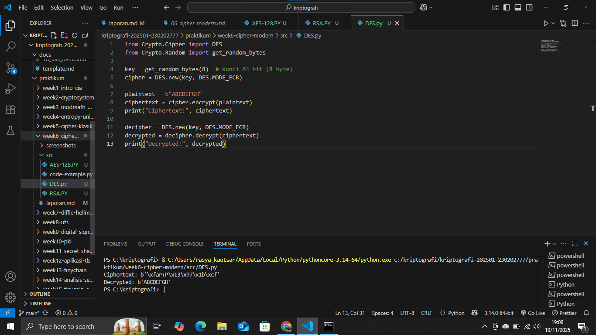
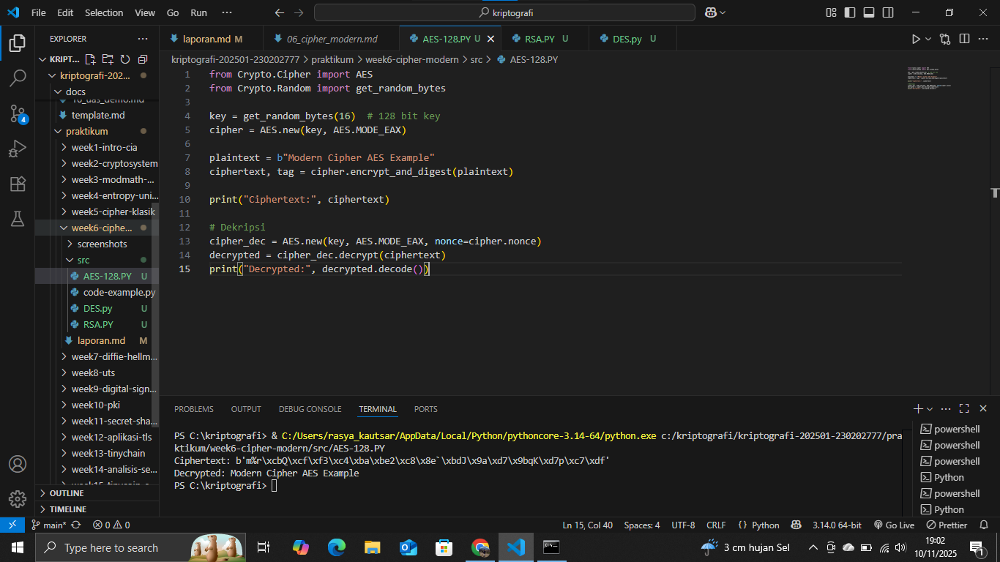
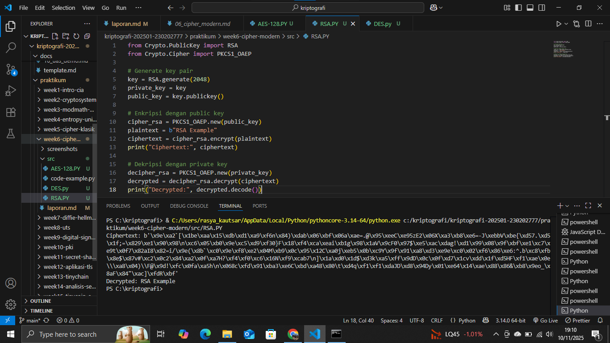

# Laporan Praktikum Kriptografi
Minggu ke-: 6  
Topik: [Cipher Modern]  
Nama: [Rasya Islami Kautsar]  
NIM: [230202777]  
Kelas: [5IKRB]  

---

## 1. Tujuan

1. Mengimplementasikan algoritma **DES** untuk blok data sederhana.  
2. Menerapkan algoritma **AES** dengan panjang kunci 128 bit.  
3. Menjelaskan proses pembangkitan kunci publik dan privat pada algoritma **RSA**.

---

## 2. Dasar Teori

Cipher modern adalah bentuk kriptografi yang dirancang untuk melindungi data digital melalui proses enkripsi dan dekripsi menggunakan algoritma matematika yang kompleks. Berbeda dengan cipher klasik yang hanya mengandalkan substitusi atau pergeseran huruf, cipher modern bekerja pada tingkat biner dan memanfaatkan operasi logika, substitusi, serta permutasi dengan kunci panjang untuk mencapai keamanan tinggi. Tujuan utamanya meliputi menjaga kerahasiaan, keaslian, dan integritas data pada berbagai bidang seperti komunikasi digital, transaksi perbankan, dan keamanan jaringan komputer.

Salah satu algoritma penting dalam perkembangan cipher modern adalah Data Encryption Standard (DES), yang diperkenalkan pada tahun 1977. DES merupakan algoritma simetris dengan panjang kunci 56 bit dan bekerja dengan membagi data menjadi blok 64 bit untuk diproses melalui 16 tahap enkripsi berbasis substitusi dan permutasi. Walaupun pernah menjadi standar keamanan global, kemampuan komputasi modern membuat DES rentan terhadap serangan brute force karena ukuran kuncinya terlalu pendek. Untuk meningkatkan keamanannya, dikembangkan versi lanjutan yaitu Triple DES (3DES), sebelum akhirnya digantikan oleh algoritma yang lebih efisien dan kuat, yaitu Advanced Encryption Standard (AES).

Saat ini, AES dan RSA menjadi tulang punggung sistem kriptografi modern. AES merupakan algoritma simetris berbasis blok dengan panjang kunci 128, 192, atau 256 bit, dikenal karena kecepatan dan efisiensinya dalam melindungi data pada sistem seperti jaringan Wi-Fi, VPN, dan layanan cloud. Sementara itu, RSA adalah algoritma asimetris yang menggunakan pasangan kunci publik dan privat berdasarkan konsep faktorisasi bilangan prima besar. RSA banyak digunakan dalam komunikasi aman, tanda tangan digital, dan distribusi kunci. Kombinasi antara AES dan RSA kini menjadi dasar utama dalam sistem keamanan data digital modern.

---

## 3. Alat dan Bahan

- Python 3.x
- Visual Studio Code
- Git dan akun GitHub
- Google chrome
- Library tambahan (misalnya pycryptodome, jika diperlukan)

---

## 4. Langkah Percobaan

1. Membuat file DES.py di folder praktikum/week6-cipher-modern/src/.
2. Membuat file AES-128.py di folder praktikum/week6-cipher-modern/src/.
3. Membuat file RSA.py di folder praktikum/week6-cipher-modern/src/.
4. Menyalin kode program dari panduan praktikum.
5. Menjalankan program dengan perintah sesuai pada file.

---

## 5. Source Code

- **Langkah 1 — Implementasi DES (Opsional, Simulasi)**
```
from Crypto.Cipher import DES
from Crypto.Random import get_random_bytes

key = get_random_bytes(8)  # kunci 64 bit (8 byte)
cipher = DES.new(key, DES.MODE_ECB)

plaintext = b"ABCDEFGH"
ciphertext = cipher.encrypt(plaintext)
print("Ciphertext:", ciphertext)

decipher = DES.new(key, DES.MODE_ECB)
decrypted = decipher.decrypt(ciphertext)
print("Decrypted:", decrypted)
```

**Hasil uji coba (Output program)**
```
Ciphertext: b'\xfar+P\x13\x97\x1b\xcf'
Decrypted: b'ABCDEFGH'
```

- **Langkah 2 — Implementasi AES-128**
```
from Crypto.Cipher import AES
from Crypto.Random import get_random_bytes

key = get_random_bytes(16)  # 128 bit key
cipher = AES.new(key, AES.MODE_EAX)

plaintext = b"Modern Cipher AES Example"
ciphertext, tag = cipher.encrypt_and_digest(plaintext)

print("Ciphertext:", ciphertext)

# Dekripsi
cipher_dec = AES.new(key, AES.MODE_EAX, nonce=cipher.nonce)
decrypted = cipher_dec.decrypt(ciphertext)
print("Decrypted:", decrypted.decode())
```

**Hasil uji coba (Output program)**
```
Ciphertext: b'm%r\xcbQ\xcf\xf3\xc4\xba\xbe2\xc8\x8e`\xbdJ\x9a\xd7\x9bqK\xd7p\xc7\xdf'
Decrypted: Modern Cipher AES Example
```

- **Langkah 3 — Implementasi RSA**
```
from Crypto.PublicKey import RSA
from Crypto.Cipher import PKCS1_OAEP

# Generate key pair
key = RSA.generate(2048)
private_key = key
public_key = key.publickey()

# Enkripsi dengan public key
cipher_rsa = PKCS1_OAEP.new(public_key)
plaintext = b"RSA Example"
ciphertext = cipher_rsa.encrypt(plaintext)
print("Ciphertext:", ciphertext)

# Dekripsi dengan private key
decipher_rsa = PKCS1_OAEP.new(private_key)
decrypted = decipher_rsa.decrypt(ciphertext)
print("Decrypted:", decrypted.decode())
```

**Hasil uji coba (Output program)**
```
Ciphertext: b'\x9e\xa2`[\x1be\xaa\x15\xdb\xd1\xa9\xf6n\x84)\xdab\x06\xbf\x06a\xae=.@\x95\xeeC\xe95zE2\x06X\xa3\xb8\xe6=-J\xebbV\xbe{\xd57.\xd5\x1f;=\x829\xe1\x90\x98\n\xc6\x05\xb0\x9e\xc5\xd9\xf30}F\x18\xf4\xca\xeai\xb1g\x98\x1aV\x9cF0\x97$\xe5\xac\xdag!\xd1\x99\x08\x9f\xbf\xe1\xc7\xe9t\x0f7\x82aI8\x82=i/\x9e(\x8b`\xc0\x9e\xf8\xe2\x04M\xb9\x0c\x95\x12C\xa0j\xeb5\x0b\xc9Y\x9f\x91\xa8\xd3\xe9e\xc0\x02\xf6\x86\xe6:^.b\xc8\xfb\x8e$\x87v#\xc2\x0c2\x84\xa2\x0f\xa7H?\xf4\xf0\xc6\x16N\xf9\xcab7\n]\x1a\xd0\x1d$\xd3k\xa5\xff\x9dD\x0c\x0f\xd7\x1cv\xdd\x1f\xd5HF\xf1\xae\x0e\\\xa8\x04)\\F@\x9d!\xfc\x0fa\xa5h\n\x068c\xfd\x91\xba3\xe6C\xbd\xa48\x80\t\xd4q\xf1\xf1\xdaJD\xd8\x94Dy\x01\xe64\x14\xae\x88\x86&\xb8\x9eo_\x8aF\x84"\xac]\xfdR\xbf'
Decrypted: RSA Example
```

---

## 6. Hasil dan Pembahasan

- **Hasil eksekusi Langkah 1 — Implementasi DES (Opsional, Simulasi)**


- **Hasil eksekusi Langkah 2 — Implementasi AES-128**


- **Hasil eksekusi Langkah 3 — Implementasi RSA**


**Pembahasan:**

Percobaan berhasil mengimplementasikan DES, AES-128, dan RSA-2048. DES secara fungsional berhasil mengenkripsi dan mendekripsi data, namun menegaskan statusnya sebagai algoritma tidak aman karena kunci 56-bit yang pendek. AES-128 menunjukkan performa superior, berhasil melakukan enkripsi dan dekripsi menggunakan kunci 128-bit, mengukuhkan perannya sebagai standar simetris yang cepat dan kuat. Terakhir, RSA-2048 berhasil mengilustrasikan kriptografi asimetris dengan menggunakan pasangan kunci publik/privat, membuktikan fungsinya yang ideal untuk pertukaran kunci dan tanda tangan digital, meskipun kecepatannya relatif lebih lambat.

---

## 7. Jawaban Pertanyaan

1. Apa perbedaan mendasar antara DES, AES, dan RSA dalam hal kunci dan keamanan?

Perbedaan mendasar antara ketiga algoritma ini terletak pada jenis kriptografi dan struktur kuncinya. DES (Data Encryption Standard) dan AES (Advanced Encryption Standard) adalah algoritma simetris yang menggunakan satu kunci rahasia untuk enkripsi dan dekripsi. AES jauh lebih unggul dalam keamanan dan kecepatan karena menggunakan panjang kunci yang lebih besar (128, 192, atau 256 bit) dibandingkan DES yang hanya 56 bit, membuat DES tidak aman untuk penggunaan modern. Sebaliknya, RSA (Rivest–Shamir–Adleman) adalah algoritma asimetris yang menggunakan pasangan kunci (kunci publik untuk enkripsi dan kunci privat untuk dekripsi) meskipun menawarkan pertukaran kunci yang aman, RSA bekerja jauh lebih lambat daripada AES dan membutuhkan panjang kunci yang jauh lebih besar (ribuan bit) untuk mencapai tingkat keamanan yang sebanding.

2. Mengapa AES lebih banyak digunakan dibanding DES di era modern?

Karena kelemahan keamanan kritis pada DES. DES hanya menggunakan kunci efektif 56 bit, yang saat ini dapat dipecahkan menggunakan serangan brute-force dalam waktu singkat dengan kekuatan komputasi modern, sehingga membuatnya tidak aman. Sebaliknya, AES unggul dengan menawarkan keamanan yang luar biasa berkat panjang kunci yang jauh lebih besar (128, 192, atau 256 bit), yang secara astronomis tidak mungkin dipecahkan, sekaligus menyediakan kinerja dan efisiensi yang sangat baik dan cepat dalam implementasi hardware maupun software, menjadikannya standar de facto untuk enkripsi data massal di seluruh dunia.

3. Mengapa RSA dikategorikan sebagai algoritma asimetris, dan bagaimana proses pembangkitan kuncinya?  

 Karena menggunakan pasangan kunci yang berbeda, kunci publik untuk enkripsi dan kunci privat untuk dekripsi di mana kunci privat tidak dapat dihitung dari kunci publik. Proses pembangkitan kuncinya berakar pada kesulitan memfaktorkan bilangan besar, dimulai dengan memilih dua bilangan prima besar (p dan q) kemudian menghitung modulus (n = p x q) dan fungsi Totient (n). Terakhir, ia memilih eksponen publik (e) dan menghitung eksponen privat (d) sebagai invers modularnya, di mana pasangan (e, n) menjadi Kunci Publik dan (d, n) menjadi Kunci Privat.

---

## 8. Kesimpulan

Praktikum ini berhasil mengimplementasikan tiga cipher modern (DES, AES, dan RSA), mengkonfirmasi bahwa DES sudah usang karena kunci 56-bitnya tidak aman. AES dengan kunci 128-bit terbukti efisien dan kuat sebagai cipher simetris untuk enkripsi data massal. Sementara itu, RSA berhasil diimplementasikan sebagai cipher asimetris dengan pasangan kunci publik/privat 2048-bit, menegaskan perannya yang vital dalam pertukaran kunci dan keamanan data yang memerlukan otentikasi di sistem kriptografi hibrida modern.

---

## 9. Daftar Pustaka

- Stallings, W. (2020). Cryptography and Network Security: Principles and Practice (8th ed.). Pearson Education.
- NIST. (2001). Advanced Encryption Standard (AES). Federal Information Processing Standards Publication 197.
- Rivest, R. L., Shamir, A., & Adleman, L. (1978). A Method for Obtaining Digital Signatures and Public-Key Cryptosystems. Communications of the ACM, 21(2), 120-126.
- Sumber referensi perkuliahan/modul praktikum terkait Cipher Modern (DES, AES, RSA)

---

## 10. Commit Log

```
commit week6-cipher-modern
Author: Rasya Islami Kautsar <rasyakautsar01@gmail.com>
Date:   2025-11-10

    week6-cipher-modern: Cipher Modern (DES, AES, RSA)                       
```
