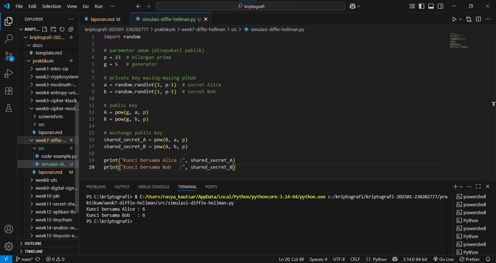
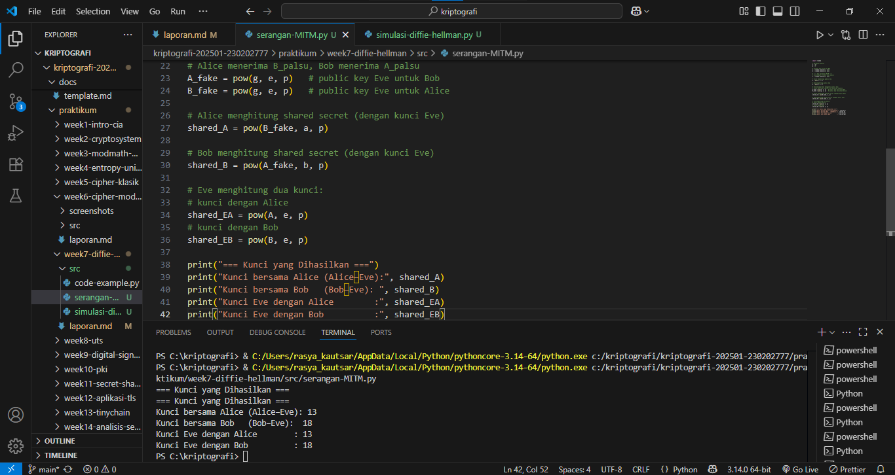

# Laporan Praktikum Kriptografi
Minggu ke-: 7  
Topik: [Diffie-Hellman Key Exchange]  
Nama: [Rasya Islami Kautsar]  
NIM: [230202777]  
Kelas: [5IKRB]  

---

## 1. Tujuan

1. Melakukan simulasi protokol **Diffie-Hellman** untuk pertukaran kunci publik.  
2. Menjelaskan mekanisme pertukaran kunci rahasia menggunakan bilangan prima dan logaritma diskrit.  
3. Menganalisis potensi serangan pada protokol Diffie-Hellman (termasuk serangan **Man-in-the-Middle / MITM**).

---

## 2. Dasar Teori

Diffie–Hellman adalah metode untuk bertukar kunci kriptografis secara aman melalui saluran publik dan menjadi salah satu protokol kunci publik pertama yang disusun oleh Ralph Merkle dan dinamai dari Whitfield Diffie and Martin Hellman. Diffie–Hellman adalah salah satu contoh penggunaan awal pertukaran kunci publik yang diimplementasikan dalam bidang kriptografi. Metode ini dipublikasikan pada tahun 1976 oleh Diffie dan Hellman dan menjadi karya publik pertama yang mengusulkan ide tentang pasangan kunci pribadi dan kunci publik.

Sebelumnya, sambungan aman terenkripsi antara dua pihak membutuhkan pertukaran kunci secara fisik, misal daftar kunci yang ditulis di kertas lalu diantar oleh kurir. Metode pertukaran kunci Diffie–Hellman dapat dipakai oleh kedua pihak yang tidak tahu apa pun sebelumnya untuk membuat kunci rahasia bersama melalui saluran tak aman. Kunci ini kemudian dapat dipakai untuk berkomunikasi dengan penyandian kunci simetris.

---

## 3. Alat dan Bahan

- Python 3.x
- Visual Studio Code
- Git dan akun GitHub
- Google chrome
- Library tambahan (misalnya pycryptodome, jika diperlukan)

---

## 4. Langkah Percobaan

1. Membuat file simulasi-diffie-hellman.py di folder praktikum/week7-diffie-hellman/src/.
2. Membuat file serangan-MITM.py di folder praktikum/week7-diffie-hellman/src/.
3. Menyalin kode program dari panduan praktikum.
4. Menjalankan program dengan perintah python simulasi-diffie-hellman.py.
5. Membuat folder screenshots dan menguploud file hasil.jpg pada folder praktikum/week7-diffie-hellman/Sreenshots/.
6. Menjalankan program dengan perintah sesuai pada file.

---

## 5. Source Code

- **Langkah 1 — Simulasi Diffie-Hellman**
```
import random

# parameter umum (disepakati publik)
p = 23  # bilangan prima
g = 5   # generator

# private key masing-masing pihak
a = random.randint(1, p-1)  # secret Alice
b = random.randint(1, p-1)  # secret Bob

# public key
A = pow(g, a, p)
B = pow(g, b, p)

# exchange public key
shared_secret_A = pow(B, a, p)
shared_secret_B = pow(A, b, p)

print("Kunci bersama Alice :", shared_secret_A)
print("Kunci bersama Bob   :", shared_secret_B)
```

**Hasil uji coba (Output program)**
```
Kunci bersama Alice : 6
Kunci bersama Bob   : 6
```

- **Langkah 2 —  Analisis Serangan MITM (Man-in-the-Middle)**
```
import random

# parameter publik
p = 23
g = 5

# private key Alice dan Bob
a = random.randint(1, p-1)
b = random.randint(1, p-1)

# ---- Eve melakukan MITM ----
# Eve membuat private key sendiri
e = random.randint(1, p-1)

# Alice menghitung public key
A = pow(g, a, p)

# Bob menghitung public key
B = pow(g, b, p)

# Eve mencegat dan mengganti public key:
# Alice menerima B_palsu, Bob menerima A_palsu
A_fake = pow(g, e, p)   # public key Eve untuk Bob
B_fake = pow(g, e, p)   # public key Eve untuk Alice

# Alice menghitung shared secret (dengan kunci Eve)
shared_A = pow(B_fake, a, p)

# Bob menghitung shared secret (dengan kunci Eve)
shared_B = pow(A_fake, b, p)

# Eve menghitung dua kunci:
# kunci dengan Alice
shared_EA = pow(A, e, p)
# kunci dengan Bob
shared_EB = pow(B, e, p)

print("=== Kunci yang Dihasilkan ===")
print("Kunci bersama Alice (Alice–Eve):", shared_A)
print("Kunci bersama Bob   (Bob–Eve): ", shared_B)
print("Kunci Eve dengan Alice        :", shared_EA)
print("Kunci Eve dengan Bob          :", shared_EB)
```

**Hasil uji coba (Output program)**
```
Kunci bersama Alice (Alice–Eve): 13
Kunci bersama Bob   (Bob–Eve):  18
Kunci Eve dengan Alice        : 13
Kunci Eve dengan Bob          : 18
```

- **Penjelasan simulasi:**

1. Simulasi Diffie-Hellman 
    - Alice dan Bob memilih bilangan publik p=23 dan g=5.
    - Keduanya membuat private key acak lalu menghitung public key masing-masing.
    - Setelah bertukar public key, mereka menghitung shared secret dengan rumus modular eksponensial.
    - Hasil akhirnya kunci Alice dan Bob sama (6) → protokol bekerja dengan benar.

2. Simulasi Serangan MITM 
    - Eve membuat private key sendiri lalu mencegat dan mengganti public key yang dikirim Alice dan Bob.
    - Alice menghitung kunci dengan Eve, Bob juga menghitung kunci dengan Eve. Hasil: Kunci Alice–Eve = 13 Kunci Bob–Eve = 18 Ini menunjukkan bahwa Eve berhasil membuat dua kunci berbeda untuk memantau dan memodifikasi komunikasi.

---

## 6. Hasil dan Pembahasan

- **Hasil eksekusi Langkah 1 — Simulasi Diffie-Hellman**


- **Hasil eksekusi Langkah 2 — Analisis Serangan MITM (Man-in-the-Middle)**


**Pembahasan:**

Pada percobaan ini diterapkan protokol Diffie–Hellman untuk melakukan pertukaran kunci melalui saluran publik. Hasil simulasi menunjukkan bahwa Alice dan Bob dapat menghasilkan kunci rahasia yang identik meskipun hanya bertukar nilai publik, berkat sifat sulitnya menyelesaikan discrete logarithm problem. Percobaan kedua menunjukkan kelemahan utama Diffie–Hellman murni, yaitu rentan terhadap serangan Man-in-the-Middle. Eve dapat mencegat dan mengganti nilai publik yang ditukar, sehingga menghasilkan dua kunci berbeda untuk berkomunikasi dengan masing-masing pihak. Hal ini membuktikan bahwa tanpa autentikasi tambahan, protokol Diffie–Hellman tidak mampu menjamin identitas pihak yang berkomunikasi.

---

## 7. Jawaban Pertanyaan

1. Mengapa Diffie-Hellman memungkinkan pertukaran kunci di saluran publik?

Karena hanya memanfaatkan informasi publik yang tidak cukup bagi penyerang untuk menghitung kunci rahasia, sementara kedua pihak dapat menghitungnya berkat operasi matematika yang simetris tetapi satu arah sulit dibalik.

2. Apa kelemahan utama protokol Diffie-Hellman murni?

Diffie–Hellman murni tidak menyediakan autentikasi, sehingga mudah disusupi Man-in-the-Middle (MiTM) dan tidak menjamin siapa sebenarnya lawan komunikasi.

3. Bagaimana cara mencegah serangan MITM pada protokol ini?

    - Dengan cara menggunakan Digital Signature (Diffie–Hellman terautentikasi)
    - Menggunakan sertifikat digital (https)
    - Mensign nilai Diffie–Hellman dengan kunci publik statis

---

## 8. Kesimpulan

Percobaan menunjukkan bahwa protokol Diffie–Hellman dapat menghasilkan kunci rahasia bersama menggunakan nilai publik, sehingga memungkinkan komunikasi aman pada saluran terbuka. Namun, protokol ini memiliki kelemahan mendasar yaitu tidak adanya autentikasi bawaan, sehingga rentan terhadap serangan MITM. Oleh karena itu, mekanisme autentikasi seperti digital signature atau sertifikat digital diperlukan untuk meningkatkan keamanan pertukaran kunci.

---

## 9. Daftar Pustaka

- Diffie, W., & Hellman, M. (1976). New directions in cryptography. IEEE Transactions on Information Theory, 22(6), 644–654.
-  Merkle, Ralph C. (April 1978). "Secure Communications Over Insecure Channels". 21 (4): 294–299. "Received August, 1975; revised September 1977".
- Panduan Praktikum Kriptografi Minggu ke-7: Diffie-Hellman Key Exchange.

---

## 10. Commit Log

```
commit week7-diffie-hellman
Author: Rasya Islami Kautsar <rasyakautsar01@gmail.com>
Date:   2025-11-20

    week7-diffie-hellman: Diffie-Hellman Key Exchange                       
```
