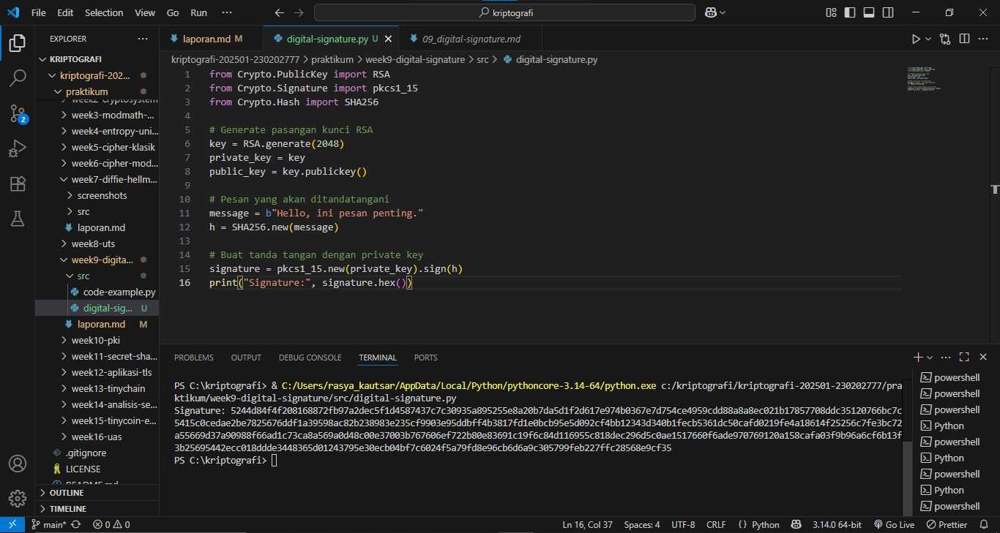
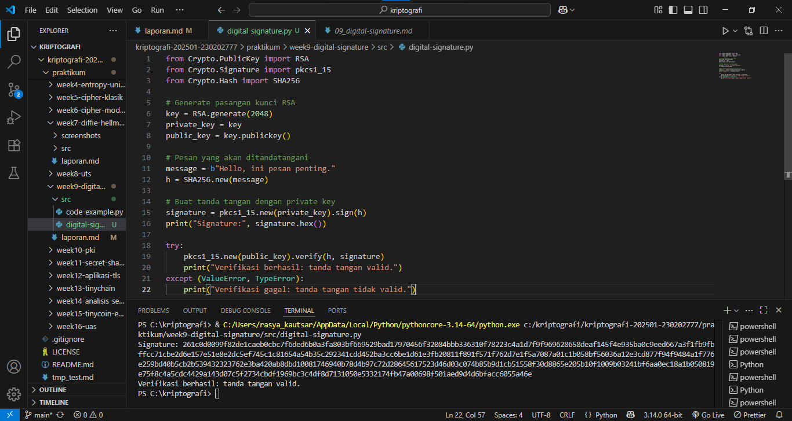
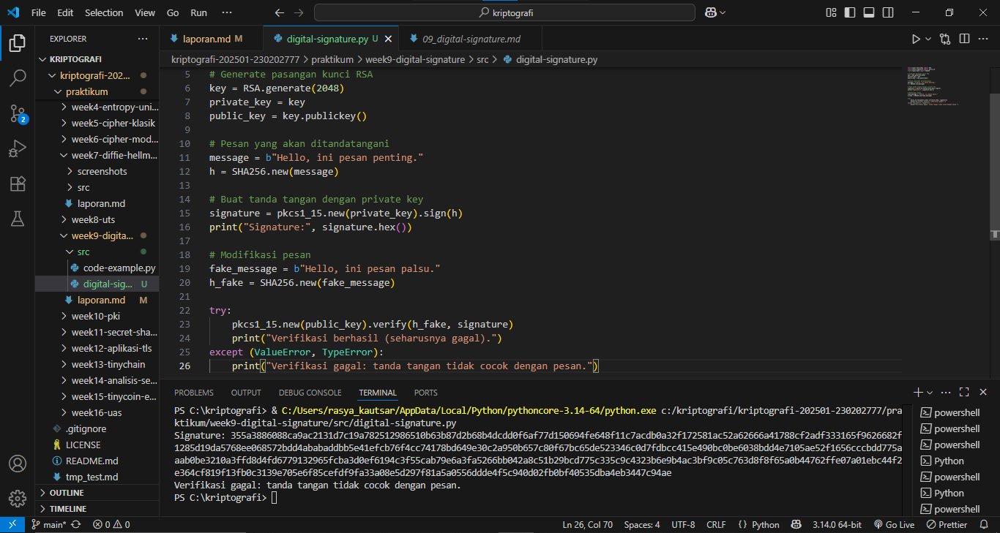

# Laporan Praktikum Kriptografi
Minggu ke-: 9  
Topik: [Digital Signature]  
Nama: [Rasya Islami Kautsar]  
NIM: [230202777]  
Kelas: [5IKRB]  

---

## 1. Tujuan

1. Mengimplementasikan tanda tangan digital menggunakan algoritma RSA/DSA.  
2. Memverifikasi keaslian tanda tangan digital.  
3. Menjelaskan manfaat tanda tangan digital dalam otentikasi pesan dan integritas data.

---

## 2. Dasar Teori

Digital Signature/Tanda tangan digital merupakan protokol kriptografi yang berfungsi untuk menjamin keaslian identitas pengirim, integritas isi data, serta aspek nirsangkal pada suatu dokumen elektronik. Secara teknis, prosedur ini diawali dengan pengonversian dokumen menjadi kode ringkas unik melalui fungsi hash, yang kemudian dikunci menggunakan kunci privat milik pengirim. Hasil dari proses inilah yang menjadi segel digital; penerima cukup menggunakan kunci publik yang sesuai untuk memverifikasi bahwa dokumen tersebut benar-benar otentik dan isinya tidak mengalami perubahan sedikit pun sejak ditandatangani.

Dalam implementasi algoritma RSA, proses penandatanganan dilakukan dengan memanfaatkan skema kunci asimetris di mana nilai hash dokumen dienkripsi untuk menciptakan bukti digital. RSA menjadi pilihan populer karena sifatnya yang serbaguna, yakni mampu menangani fungsi enkripsi rahasia sekaligus verifikasi identitas dalam satu landasan teori yang sama. Namun, seiring meningkatnya kekuatan komputasi, RSA menuntut penggunaan ukuran kunci yang semakin panjang agar tetap aman, yang berakibat pada kecepatan pemrosesan yang cenderung lebih lambat jika dibandingkan dengan algoritma yang lebih modern.

Digital Signature Algorithm hadir sebagai standar yang dirancang khusus untuk keperluan validasi dokumen tanpa memiliki kemampuan untuk enkripsi data. DSA bekerja berlandaskan kerangka matematis logaritma diskrit yang memungkinkan pembuatan tanda tangan secara lebih efisien dan cepat dari segi performa. Meski demikian, aspek keamanan DSA sangat bergantung pada kualitas bilangan acak yang dihasilkan saat proses penandatanganan; apabila angka acak tersebut dapat diprediksi atau bocor, maka kunci privat pengirim berada dalam risiko besar untuk diretas oleh pihak yang tidak bertanggung jawab.

---

## 3. Alat dan Bahan

- Python 3.x
- Visual Studio Code
- Git dan akun GitHub
- Google chrome
- Library tambahan (misalnya pycryptodome, jika diperlukan)

---

## 4. Langkah Percobaan

1. Membuat file signature.py di folder praktikum/week9-digital-signature/src/.
2. Menyalin kode program dari panduan praktikum.
3. Menjalankan program dengan perintah python signature.py
4. Mencoba memodifikasi program. 
5. Membuat folder screenshots di folder praktikum/week9-digital lalu mengupload hasil praktikum di dalam folder tersebut.

---

## 5. Source Code

- ### Langkah 1 — Generate Key dan Buat Tanda Tangan
```python
from Crypto.PublicKey import RSA
from Crypto.Signature import pkcs1_15
from Crypto.Hash import SHA256

# Generate pasangan kunci RSA
key = RSA.generate(2048)
private_key = key
public_key = key.publickey()

# Pesan yang akan ditandatangani
message = b"Hello, ini pesan penting."
h = SHA256.new(message)

# Buat tanda tangan dengan private key
signature = pkcs1_15.new(private_key).sign(h)
print("Signature:", signature.hex())
```

**Hasil uji coba (Output program)**
```
Signature: 5244d84f4f208168872fb97a2dec5f1d4587437c7c30935a895255e8a20b7da5d1f2d617e974b0367e7d754ce4959cdd88a8a8ec021b17857708ddc35120766bc7c5415c0cedae2be7825676ddf1a39598ac82b238983e235cf9903e95ddbff4b3817fd1e0bcb95e5d092cf4bb12343d340b1fecb5361dc50cafd0219fe4a18614f25256c7fe3bc72a55669d37a90988f66ad1c73ca8a569a0d48c00e37003b767606ef722b80e83691c19f6c84d116955c818dec296d5c0ae1517660f6ade970769120a158cafa03f9b96a6cf6b13f3b25695442ecc018ddde3448365d01243795e30ecb04bf7c6024f5a79fd8e96cb6d6a9c305799feb227ffc28568e9cf35
```

- ### Langkah 2 — Verifikasi Tanda Tangan
```python
try:
    pkcs1_15.new(public_key).verify(h, signature)
    print("Verifikasi berhasil: tanda tangan valid.")
except (ValueError, TypeError):
    print("Verifikasi gagal: tanda tangan tidak valid.")
```

**Hasil uji coba (Output program)**
```
Signature: 261c0d0099f82de1caeb0cbc7f6ded6b0a3fa803bf669529bad17970456f32084bbb336310f78223c4a1d7f9f969628658deaf145f4e935ba0c9eed667a3f1fb9fbffcc71cbe2d6e157e51e8e2dc5ef745c1c81654a54b35c292341cdd452ba3cc6be1d61e3fb20811f891f571f762d7e1f5a7087a01c1b058bf56036a12e3cd877f94f9484a1f776e259bd40b5cb2b539432323762e3ba420ab8dbd10081746940b78d4b97c72d28645617523d46d03c074b85b9d1cb51558f30d8865e205b10f1009b03241bf6aa0ec18a1b050819e75f8c4a5cdc4429a143d07c5f2734cbdf1969bc3c4df8d7131050e5332174fb47a00698f501aed9d4d6bfacc6055a46e
Verifikasi berhasil: tanda tangan valid.
```

- ### Langkah 3 — Uji Modifikasi Pesan
```python
# Modifikasi pesan
fake_message = b"Hello, ini pesan palsu."
h_fake = SHA256.new(fake_message)

try:
    pkcs1_15.new(public_key).verify(h_fake, signature)
    print("Verifikasi berhasil (seharusnya gagal).")
except (ValueError, TypeError):
    print("Verifikasi gagal: tanda tangan tidak cocok dengan pesan.")
```

**Hasil uji coba (Output program)**
```
Signature: 355a3886088ca9ac2131d7c19a782512986510b63b87d2b68b4dcdd0f6af77d150694fe648f11c7acdb0a32f172581ac52a62666a41788cf2adf333165f9626682f1285d19da5768ee068572bdd4ababaddbb5e41efcb76f4cc74178bd649e30c2a950b657c80f67bc65de523346c0d7fdbcc415e490bc0be6038bdd4e7105ae52f1656cccbdd775aaab0be3210a3ffd8d4fd6779132965fcba3d0ef6194c3f55cab79e6a3fa5266bb042a8c51b29bcd775c335c9c4323b6e9b4ac3bf9c05c763d8f8f65a0b44762ffe07a01ebc44f2e364cf819f13fb0c3139e705e6f85cefdf9fa33a08e5d297f81a5a0556ddde4f5c940d02fb0bf40535dba4eb3447c94ae
Verifikasi gagal: tanda tangan tidak cocok dengan pesan.
```

---

## 6. Hasil dan Pembahasan

- **Hasil eksekusi Langkah 1 — Membuat tanda tangan digital dengan RSA**


- **Hasil eksekusi Langkah 2 — Verifikasi tanda tangan digital**


- **Hasil eksekusi Langkah 2 — Uji Modifikasi Pesan**


---

## 7. Jawaban Pertanyaan

1. Apa perbedaan utama antara enkripsi RSA dan tanda tangan digital RSA?

Perbedaan utama antara enkripsi RSA dan tanda tangan digital RSA terletak pada tujuan penggunaan kunci dan arah prosesnya. Meskipun keduanya menggunakan algoritma matematika yang sama (faktor bilangan prima besar), cara kerjanya berkebalikan. Secara singkat, enkripsi digunakan untuk kerahasiaan pesan, sedangkan tanda tangan digital digunakan untuk autentikasi.

2. Mengapa tanda tangan digital menjamin integritas dan otentikasi pesan?

Tanda tangan digital menjamin integritas karena setiap perubahan isi pesan akan mengubah nilai hash sehingga tanda tangan menjadi tidak valid, dan menjamin otentikasi karena tanda tangan dibuat dengan kunci privat pengirim dan diverifikasi menggunakan kunci publiknya, sehingga memastikan pesan benar berasal dari pengirim yang sah.

3. Bagaimana peran Certificate Authority (CA) dalam sistem tanda tangan digital modern?

Certificate Authority (CA) berperan sebagai pihak tepercaya yang memverifikasi identitas pemilik kunci publik dan menerbitkan sertifikat digital yang mengikat identitas tersebut dengan kunci publiknya, sehingga penerima dapat memastikan keaslian tanda tangan digital dan mencegah pemalsuan identitas dalam komunikasi elektronik.

---

## 8. Kesimpulan

Praktikum ini menunjukkan bahwa tanda tangan digital menggunakan algoritma RSA mampu menjamin keaslian pengirim dan integritas data. Proses penandatanganan dilakukan dengan kunci privat dan diverifikasi menggunakan kunci publik, sehingga perubahan sekecil apa pun pada pesan akan menyebabkan verifikasi gagal. Dengan demikian, tanda tangan digital berperan penting dalam menjaga keamanan dan kepercayaan pada komunikasi elektronik.

---

## 9. Daftar Pustaka

- Kahn Academy. Public Key Cryptography and Digital Signatures.
- NIST. (2013). Digital Signature Standard (DSS), FIPS PUB 186-4.
- PyCryptodome Documentation. RSA and Digital Signature.
- Panduan Praktikum Kriptografi Minggu ke-9: Digital Signature (RSA/DSA).

---

## 10. Commit Log

```
commit week9-digital-signature
Author: Rasya Islami Kautsar <rasyakautsar01@gmail.com>
Date:   2025-12-28

    week9-digital-signature: Digital Signature (RSA/DSA)                       
```
